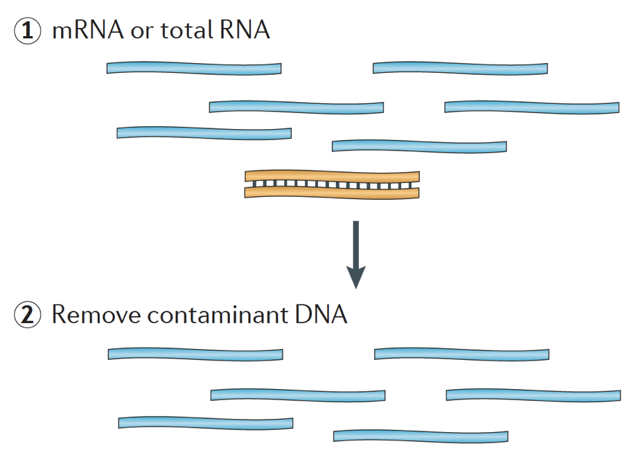
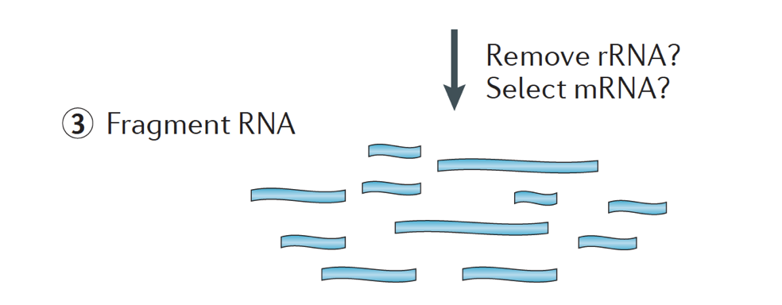
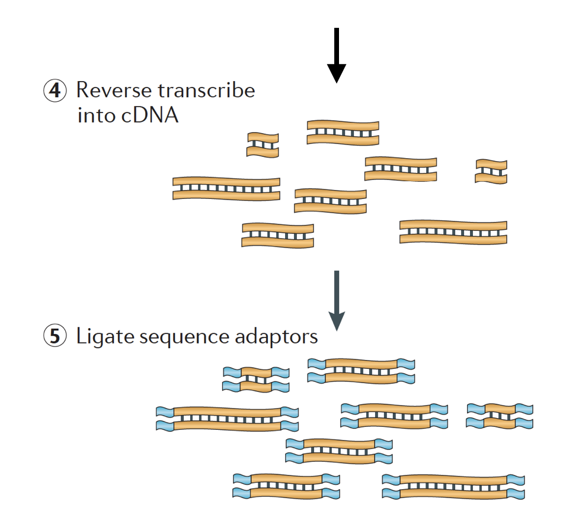
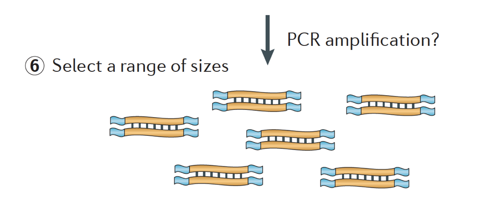

Approximate time: 90 minutes

## Learning Objectives:

* Describe the process of RNA-seq library preparation
* Describe the Illumina sequencing method

## Introduction to RNA-seq

RNA-seq is an exciting experimental technique that is utilized to explore and/or quantify gene expression within or between conditions. 

As we know, genes provide instructions to make proteins, which perform some function within the cell. Although **all cells contain the same DNA sequence**, muscle cells are different from nerve cells and other types of cells because of the **different genes that are turned on in these cells and the different RNAs and proteins produced**. 

 

Different biological processes, as well as mutations, can affect which genes are turned on and which are turned off, in addition to, *how much* specific genes are turned on/off.

To make proteins, the DNA is transcribed into messenger RNA, or mRNA, which is translated by the ribosome into protein. However, some genes encode RNA that does not get translated into protein; these RNAs are called non-coding RNAs, or ncRNAs. Often these RNAs have a function in and of themselves and include rRNAs, tRNAs, and siRNAs, among others. All RNAs transcribed from genes are called transcripts.

 

To be translated into proteins, the RNA must undergo processing to generate the mRNA. In the figure below, the top strand in the image represents a gene in the DNA, comprised of the untranslated regions (UTRs) and the open read frame. Genes are transcribed into pre-mRNA, which still contains the intronic sequences.  After post-transciptional processing, the introns are spliced out and a polyA tail and 5' cap are added to yield mature mRNA transcripts, which can be translated into proteins.

 

**While mRNA transcripts have a polyA tail, many of the non-coding RNA transcripts do not as the post-transcriptional processing is different for these transcripts.**

### Transcriptomics

The transcriptome is defined as a collection of all the transcript readouts present in a cell. RNA-seq data can be used to explore and/or quantify the transcriptome of an organism, which can be utilized for the following types of experiments:

- **Differential Gene Expression**: *quantitative* evaluation and comparison of transcript levels
- **Transcriptome assembly**: building the profile of transcribed regions of the genome, a *qualitative* evaluation. 
- Can be used to **help build better gene models**, and verify them using the assembly
- **Metatranscriptomics** or community transcriptome analysis

## Illumina library preparation

When starting an RNA-seq experiment, for every sample the RNA needs to be isolated and turned into a cDNA library for sequencing. The general workflow for library preparation is detailed in the step-by-step images below.

**Briefly, the RNA is isolated from the sample and contaminating DNA is removed with DNase.**

 
 
**The RNA sample then undergoes either selection of the mRNA (polyA selection) or depletion of the rRNA. The resulting RNA is fragmented.** 

> Generally, ribosomal RNA represents the majority of the RNAs present in a cell, while messenger RNAs represent a small percentage of total RNA, ~2% in humans. Therefore, if we want to study the protein-coding genes, we need to enrich for mRNA or deplete the rRNA. **For differential gene expression analysis, it is best to enrich for Poly(A)+, unless you are aiming to obtain information about long non-coding RNAs, then do a ribosomal RNA depletion.**

> *The size of the target fragments in the final library is a key parameter for library construction. DNA fragmentation is typically done by physical methods (i.e., acoustic shearing and sonication) or enzymatic methods (i.e., non-specific endonuclease cocktails and transposase tagmentation reactions.*
 
 

**The RNA is then reverse transcribed into double-stranded cDNA and sequence adapters are then added to the ends of the fragments.**

> The cDNA libraries can be generated in a way to retain information about which strand of DNA the RNA was transcribed from. Libraries that retain this information are called stranded libraries, which are now standard with Illumina’s TruSeq stranded RNA-Seq kits. Stranded libraries should not be any more expensive than unstranded, so there is not really any reason not to acquire this additional information. 
> 
> There are 3 types of cDNA libraries available:
> 
> * Forward (secondstrand) – reads resemble the gene sequence or the secondstrand cDNA sequence
> * Reverse (firststrand) – reads resemble the complement of the gene sequence or firststrand cDNA sequence (TruSeq)
> * Unstranded

 
 
**Finally, the fragments are PCR amplified if needed, and the fragments are size selected (usually ~300-500bp) to finish the library.**

 
 
 *Image credit: [Martin J.A. and Wang Z., Nat. Rev. Genet. (2011) 12:671–682](https://www.nature.com/articles/nrg3068)*

## Illumina Sequencing

### Single-end versus Paired-end

After preparation of the libraries, sequencing can be performed to generate the nucleotide sequences of the ends of the fragments, which are called **reads**. You will have the choice of sequencing a single end of the cDNA fragments (single-end reads) or both ends of the fragments (paired-end reads).

- SE - Single end dataset => Only Read1
- PE - Paired-end dataset => Read1 + Read2
	- can be 2 separate FastQ files or just one with interleaved pairs

Generally single-end sequencing is sufficient unless it is expected that the reads will match multiple locations on the genome (e.g. organisms with many paralogous genes), assemblies are being performed, or for splice isoform differentiation. Be aware that paired-end reads are generally 2x more expensive.

### Different sequencing platforms

There are a variety of Illumina platforms to choose from to sequence the cDNA libraries.

 *Image credit: Adapted from [Illumina](www.illumina.com)*

Differences in platform can alter the length of reads generated, the quality of reads, as well as the total number of reads sequenced per run and the amount of time required to sequence the libraries. The different platforms each use a different flow cell, which is a glass surface coated with an arrangement of paired oligos that are complementary to the adapters added to your template molecules. **The flow cell is where the sequencing reactions take place**.

 *Image credit: Adapted from [Illumina](www.illumina.com)*
 
### Sequencing-by-synthesis 

Illumina sequencing technology uses a sequencing-by-synthesis approach which is described in more detail below. 

In the step, the DNA fragments in the cDNA library are denatured and applied to the glass flow cell. These denatured fragments bind to the complementary oligos that are already covalently bound to the flow cell lanes, resulting in attachment.

#### Cluster Generation

Once the fragments have attached, a phase called **cluster generation begins**. During this step, single fragments are clonally amplified to create a cluster (fragments in close proximity) of identical fragments. This is necessary so that the fluorescence can be readily captured from each cluster, instead of a single fragment, during nucleotide incorporation in the next step.

> * Synthesize the complement with polymerase
> * dsDNA is denatured, and original DNA washed away leaving synthesized strand covalently bound to flow cell.
> * Single strand hybridises with adjacent adapter to form a ‘bridge’
> * dsDNA is extended by polymerase. Each strand covalently bound to different adapter. 
> * Repeat many times to clonally amplify all unique fragments on flow cell to form clusters of identical sequence.

#### Sequencing by synthesis (& image acquisition)

After cluster generation, fluorescently-tagged nucleotides are incorporated one at a time (cyclically) and fluorescence images are captured to identify which nucleotide gets incorporated into each cluster in each cycle.  

> * Denature clusters and the block 3’ ends to prevent unwanted priming.
> * Hybridize sequencing primers to adapter sequence at the loose ends. 
> * Cycle four NTPs with fluorescent markers and terminator sequence and polymerases.
> * Once NTP is incorporated, the cluster is excited by a light source and a characteristic fluroscent signal is emitted. 
> * The color is recorded, then the terminator on dye is cleaved and washed. Process repeats for specifioed number of cycles.

#### Base Calling

Illumina has proprietary software that goes through all the images captured in the previous stage and generates text files with sequence information about each cluster based on the fluorescence. In addition to calling the bases, this software assigns a probablity score to indicate how certain it was about the calling something an "A", a "T", a "G" or a "C". 

> If there are any ambiguities, e.g. at a certain cycle the image for a cluster does not have a distinct color that can be associated with a specific nucleotide, the base calling software will have a low probability associated with it and would assign an "N" instead of "A", "T", "G" or "C".

In closing,
* **Number of clusters ~= Number of reads**
* **Number of sequencing cycles = Length of reads**

The number of cycles (length of the reads) will depend on sequencing platform used as well as your preferences.

> **NOTE**. If you want to explore sequencing by synthesis in more depth, we recommend this really nice animation [available on Illumina's YouTube channel](https://www.youtube.com/watch?v=fCd6B5HRaZ8).

### Multiplexing

Depending on the Illumina platform (MiSeq, HiSeq, NextSeq), the number of lanes per flow cell, and the number of reads that can be obtained per lane varies widely. **You will need to decide on how many reads you would like per sample** (i.e. the sequencning depth) and then based on the platform you choose calculate how many total lanes you will require for your set of samples. We will talk more about considerations when making this decision in the next lesson on [Experimental Considerations](https://hbctraining.github.io/Intro-to-rnaseq-hpc-salmon/lessons/experimental_planning_considerations.html)

Typically, charges for sequencing are per lane of the flow cell and you will be able to run multiple samples per lane. Illumina has therefore devised a nice multiplexing method which allows libraries from several samples to be pooled and sequenced simultaneously in the same lane of a flow cell. This method requires **the addition of indices** (within the Illumina adapter) or special barcodes (outside the Illumina adapter) as described in the schematic below.

> **NOTE:** The workflow presented in this lesson is specific to Illumina sequencing, which is currently the most utilized sequencing method. But there are other long-read sequencing methods worth noting, such as:
>
> - Pacific Biosciences: http://www.pacb.com/ 
> - Oxford Nanopore (MinION): https://nanoporetech.com/ 
> - 10X Genomics: https://www.10xgenomics.com/ 
> 
> Advantages and disadvantages of these technologies can be explored in the table below:
>
> 

---
*This lesson has been developed by members of the teaching team at the [Harvard Chan Bioinformatics Core (HBC)](http://bioinformatics.sph.harvard.edu/). These are open access materials distributed under the terms of the [Creative Commons Attribution license](https://creativecommons.org/licenses/by/4.0/) (CC BY 4.0), which permits unrestricted use, distribution, and reproduction in any medium, provided the original author and source are credited.*
