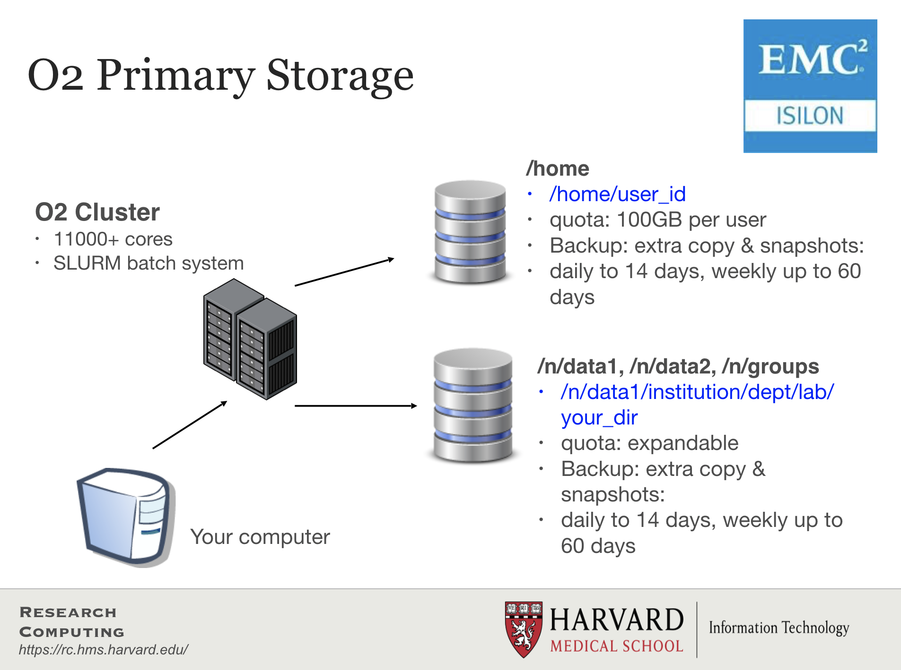

# Working in an HPC environment

## Clarifying some terminology

### Cores 
CPUs (Central Processing Units) are composed of a single or multiple cores. If I have a processor with 4 "cores", i.e. a "quad-core" processor. This means that my processor can do 4 distinct computations at the same time. 

### Data Storage
Data storage is measured in bytes, usually Gigabytes (GB), Terabytes (TB), Petabytes (PB). My laptop has 1 TB of storage, which is pretty standard for laptops.

### Memory
Memory is a small amount of volatile or temporary information storage. This is distinct from data storage we discussed in the previous point. It is an essential component of any computer, as this is where data is stored *when some computation is being performed* on it. If you have ever used R, all the objects in your environment are usually stored in memory until you save your environment. My laptop has 16 GB of memory, which is a little higher than average.

## Why use the cluster or an HPC environment?

1. A lot of software is designed to work with the resources on an HPC environment and is either unavailable for, or unusable on, a personal computer.
2. If you are performing analysis on large data files (e.g. high-throughput sequencing data), you should work on the cluster to avoid issues with memory and to get the analysis done a lot faster with the superior processing capacity. Essentially, a cluster has:
    * 100s of cores for processing!
    * 100s of Gigabytes or Petabytes of storage!
    * 100s of Gigabytes of memory!

### Parallelization

Point #2 in the last section brings us to the idea of **parallelization** or parallel computing that enables us to efficiently use the resources available on the cluster.

What if we had 3 input files that we wanted to analyze? Well, we could process these files **in serial**, i.e. use the same core(s) over and over again, with or without multithreading, as shown in the image below.

<p align="center">

</p>

This is great, but it is not as efficient as multithreading each analysis, and using a set of 8 cores for each of the three input samples. With this type of parallelization, several samples can be analysed at the same time!

<p align="center">

</p>

## Connect to a *login* node on O2

Let's get started with the hands-on component by typing in the following command to log in to O2:

```bash
ssh username@o2.hms.harvard.edu
```

You will receive a prompt for your password, and you should type in your associated password; **note that the cursor will *not move* as you type in your password**.

A warning might pop up the first time you try to connect to a remote machine, type "Yes" or "Y". 

Once logged in, you should see the O2 icon, some news, and the command prompt, e.g. `[rc_training10@login01 ~]$`.

> Note 1: `ssh` stands for secure shell. All of the information (like your password) going between your computer and the O2 login computer is encrypted when using `ssh`.

About nodes:
* A "node" on a cluster is essentially a computer in the cluster of computers. 
* There are dedicated login nodes and compute nodes.
* A login node's only function is to enable users to log in to a cluster, it is not meant to be used for any actual work/computing. There are 6 login nodes on O2.
* There are several hundred compute nodes on O2 available for performing your analysis/work. 

## Connect to a *compute* node on O2

You can access compute nodes in 2 ways using a job scheduler or resource manager like Slurm.
1. Directly using an interactive session (Slurm's `srun` command): 
    * The `srun` command with a few mandatory parameters will create an "interactive session" on O2. 
    * This is essentially a way for us to do work on the compute node directly from the terminal. 
    * If the connectivity to the cluster is lost in the middle of a command being run that work will be lost in an interactive session.
1. By starting a "batch" job (Slurm's `sbatch` command): 
    * The `sbatch` command with a few mandatory parameters + a specialized shell script will result in the script being run on a compute node. 
    * This "job" will not be accessible directly from the Terminal and will run in the background. 
    * Users do not need to remain connected to the cluster when such a "batch job" is running.

For now let's start an interactive session on O2 using `srun`. 

```bash
$ srun --pty -p interactive -t 0-3:00 --mem 1G --reservation=HBC1 /bin/bash
```

In the above command the parameters we are using are requesting specific resources:
* `--pty` - Start an interactive session
* `-p interactive` - on the "partition" called "interactive" (a partition is a group of computers dedicated to certain types of jobs, interactive, long, short, high-memory, etc.)
* `-t 0-8:00` - time needed for this work: 0 days, 8 hours, 0 minutes.
* `--mem 1G` - memory needed - 1 gibibyte (GiB)
* `--reservation=HBC1` - *this is only for **in class** portions of this workshop, make sure you don't use it for self-learning or when you have your own accounts.*
* `/bin/bash` - You want to interact with the compute node using the *bash* shell

> These parameters are used for `sbatch` as well, but they are listed differently within the script used to submit a batch job. We will be reviewing this later in this lesson.

**Make sure that your command prompt now contains the word "compute", *e.g. `[rc_training10@compute-a-16-163 ~]$`*.** 
You are now working on a compute node directly in an "interactive" session!

Let's check how many jobs we have running currently, and what resources they are using.

```bash
$ O2squeue
```

## More about Slurm

* Slurm = Simple Linux Utility for Resource Management
* Fairly allocates access to resources (computer nodes) to users for some duration of time so they can perform work
* Provides a framework for starting, executing, and monitoring batch jobs
* Manages a queue of pending jobs; ensures that no single user or core monopolizes the cluster

### Requesting resources from Slurm

Below is table with some of the arguments you can specify when requesting resources from Slurm for both `srun` and `sbatch`:

| Argument | Description / Input | Examples | Links |
|:-----------:|:----------:|:--------:|:----------:|
| -p | name of compute partition | short, medium, interactive | [O2 Wiki - Guidelines for choosing a partition](https://wiki.rc.hms.harvard.edu/display/O2/How+to+choose+a+partition+in+O2) | 
| -t | how much time to allocate to job | 0-03:00, 5:00:00 | [O2 Wiki - Time limits for each partition](https://harvardmed.atlassian.net/wiki/spaces/O2/pages/1586793632/Using+Slurm+Basic#Time-limits) |
| -c | max cores | 4, 8 | [O2 Wiki - How many cores?](https://harvardmed.atlassian.net/wiki/spaces/O2/pages/1586793632/Using+Slurm+Basic#How-many-cores?) |
| --mem | max memory | 8G, 8000 | [O2 Wiki - Memory requirements](https://harvardmed.atlassian.net/wiki/spaces/O2/pages/1586793632/Using+Slurm+Basic#Memory-requirements) |
| -o | name of file to create with standard output | %j.out | [O2 Wiki](https://wiki.rc.hms.harvard.edu/display/O2/Using+Slurm+Basic#UsingSlurmBasic-sbatchoptionsquickreference) |
| -e | name of file to create with standard error | %j.err | [O2 Wiki](https://wiki.rc.hms.harvard.edu/display/O2/Using+Slurm+Basic#UsingSlurmBasic-sbatchoptionsquickreference) |
| -J | name of the job | Fastqc_run, rnaseq_workflow_mov10 | [O2 Wiki](https://wiki.rc.hms.harvard.edu/display/O2/Using+Slurm+Basic#UsingSlurmBasic-sbatchoptionsquickreference) |
| --mail-type | send an email when job starts, ends or errors out  | END, ALL | [O2 Wiki](https://wiki.rc.hms.harvard.edu/display/O2/Using+Slurm+Basic#UsingSlurmBasic-sbatchoptionsquickreference) |
| --mail-user | send email to this address | xyz10@harvard.edu | [O2 Wiki](https://wiki.rc.hms.harvard.edu/display/O2/Using+Slurm+Basic#UsingSlurmBasic-sbatchoptionsquickreference) |

### `sbatch` job submission script

An `sbatch` job submission script is essentially a normal shell script with the Slurm resource request specified at the top (Slurm directives) preceded by `#SBATCH`. Below is an example of an sbatch shell script that is requesting the following: 
* the "short" partition for 2 hours 
* on 4 cores (30 minutes for each core)
* using 400MiB (100MiB for each core)

***DO NOT RUN***
```
#! /bin/sh

#SBATCH -p short
#SBATCH –t 0-02:00
#SBATCH –c 4
#SBATCH --mem=400M
#SBATCH –o %j.out
#SBATCH –e %j.err
#SBATCH -J fastqc_run
#SBATCH --mail-type=ALL
#SBATCH –-mail-user=xyz10@med.harvard.edu

## Load the fastqc module
module load fastqc/0.11.5

# run fastqc (multithreaded)
fastqc -t 4 file1_1.fq file1_2.fq file2_1.fq file2_2.fq
```

## Using software on O2

### LMOD system

In the above example we want to run the FastQC tool on four files. However, before we use the `fastqc` command, we've used the command `module load fastqc/0.11.5`. This `module load` command is part of the LMOD system available on O2. It enables users to access software installed on O2 easily, and manages every software's dependency. The LMOD system adds directory paths of software executables and their dependencies (if any) into the `$PATH` variable.

So, instead of using `/n/app/fastqc/0.11.5/bin/fastqc` as our command, we can load the module and use `fastqc` as the command. 

Some key LMOD commands are listed below:

| LMOD command | description |
|:---------:|:---------:|
| `module spider` | List all possible modules on the cluster |
| `module spider modulename` | List all possible versions of that module |
| `module avail` | List available modules available on the cluster |
| `module avail string` | List available modules containing that string |
| `module load modulename/version` | Add the full path to the tool to `$PATH` (and modify other environment variables)|
| `module list` | List loaded modules | 
| `module unload modulename/version` | Unload a specific module |
| `module purge` | Unload all loaded modules |

> Note: On O2, a lot of tools used for analysis of sequencing data need to have the `gcc` compiler module loaded (`module load gcc/6.2.0`) prior to loading the tool of interest.

*** 
**Exercise**

1. What are the contents of the `$PATH` environment variable?
1. Try running the `multiqc` command. What do you get as output?
1. Check if the `multiqc` tool is available as a module. How many versions of `multiqc` are available?
1. Load `multiqc/1.9`. Did you have to load any additional modules?
1. List all the modules loaded in your environment
1. Try running the `multiqc` command again. What do you get as output?
1. Use the `which` command to find out where the `multiqc` tool is in the file system.
1. Check the contents of the `$PATH` environment variable again. Any changes compared to before?

***

## Filesystems on O2

<p align="center">

</p>

* Storage on HPC systems is organized differently than on your personal machine.
* Each node on the cluster does not have storage; instead, it is on disks bundled together externally.
* Storage filesystems can be quite complex, with large spaces dedicated to a pre-defined purpose.
* Filesystems are accessed over the internal network by all the nodes on the cluster.
* There are 3 major groups on the O2 cluster, each with their features and constraints:
   1. `/n/data1`, `/n/data2`, `/n/groups` - Large datasets are stored in these parent directories (see features/constraints in the image above).
   2. `/home` - the home directories of all users are under this parent directory (see features/constraints in the image above).
   3. `/n/scratch3` - scratch space for temporary storage.

**[Please find more information about storage on O2 by clicking here.](https://it.hms.harvard.edu/our-services/research-computing/services/storage)**

### More about `/n/scratch3`

* It is for data only needed temporarily during analyses.
* Each user can use up to 10 TB and 1 million files/directories.
* Files not accessed for 30 days are automatically deleted.
* **No backups!**
* You can create your own folder using this command `/n/cluster/bin/scratch3_create.sh`

***
*This lesson has been developed by members of the teaching team at the [Harvard Chan Bioinformatics Core (HBC)](http://bioinformatics.sph.harvard.edu/). These are open access materials distributed under the terms of the [Creative Commons Attribution license](https://creativecommons.org/licenses/by/4.0/) (CC BY 4.0), which permits unrestricted use, distribution, and reproduction in any medium, provided the original author and source are credited.*
