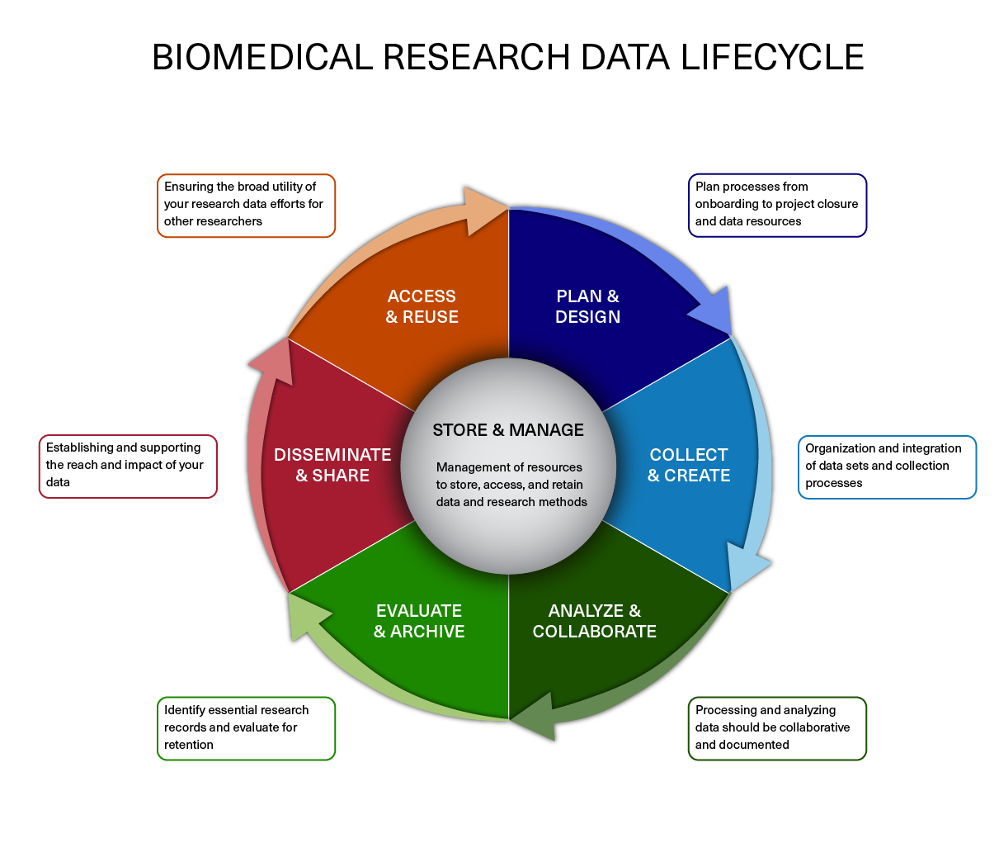

[Data management slides]: https://github.com/hbc/NGS-Data-Analysis-long-course/raw/Fall_2016/sessionI/slides/data_management.pdf

## Learning Objectives

- Explain the need for data management.
- Describe strategies for managing your own projects.

## What is data management?

In this course we teach you how to independently analyze your own sequencing data, so naturally we should begin with what what to do once you get the raw data back from the sequencing facility. Obviously, we begin with the analysis! Right?

Wrong. 

One of the most important parts of research that involves large amounts of data is how best to manage it. Once data is generated we tend to prioritize the analysis. **In the excitement to get a first look at new data, there are many important aspects that are often overlooked.**

Wait, don't leave this page just yet!

We know that data management can be hard to get excited about. However, **ignoring it can be detrimental to your research.** Here are just a few reasons **why data management should matter to you**:

* It will make your life easier. It's easier to analyze organized, and well documented data.
* Your future self will thank you. Managing well from the get-go means it's easier to retrieve at a later date.
* Data is precious. Thinking ahead about things like storage means you reduce risk of losing it.
* Funding agencies are increasingly mandating that research projects are developed with a data management plan.

### Data Lifecycle
The data lifecycle displayed below, courtesy of the [HMS Data Management Working Group](https://datamanagement.hms.harvard.edu/), illustrates some things to consider beyond data creation and analysis. Below, we discuss components of the lifecycle and how they apply to any NGS experiment.

_Image acquired from the [Harvard Biomedical Data Management Website](https://datamanagement.hms.harvard.edu/data-lifecycle)_

### Plan and Design
You should approach your sequencing project in a very similar way you do with any biological experiment, and ideally, begins with a good **experimental design**. You want to think about experiment at the outset and collect appropriate samples such that you have enough statistical power to make the comparisons you need. In a later lesson, we delve more into the details of planning and the experimental design considerations. Planning for your computational work is just as important as planning when working on the bench. Every computational analysis you do is going to spawn many files and you will want to think about short-term storage options for your data and computational resources for analyzing it. 

### Collect and Create
The next step is preparing samples as required. During this stage it is important to keep track of how the experiment was performed, making sure to clearly document the source of starting materials and kits used. It is also best practice to include any information about any small variations within the experiment (across the different samples being prepared) or any changes relative to standard experiment protocols. This collection of information serves as the **metadata of the experiment** which will prove to be very useful during the analysis stage. 

### Analyze and Collaborate
Once you have the sequencing data back from the sequencing facility, it's time to analyze it. The process of data analysis should be well documented to ensure reproducibility and also for ease of collaboration. We will spend some more time on this component of the lifecycle later in class, as it applies to our dataset.

### Evaluate and Archive
When the analysis is complete you will want to think about which files are most pertinent to keep. Consider long-term storage options for your data that meet requirements of NIH, other funding agencies, and any guidelines from your institution.

### Disseminate and share
The results of your analysis will hopefully generate some exciting findings that will be beneficial to the scientific community. At this stage in the lifecycle you rely on your previous steps of documentation to turn those notes into a clear and concise methods section of your manuscript. 

### Access and Reuse
In addition to sharing information on the analysis, you should plan for sharing the data. It has become increasingly common for researchers to make their data available to others when they complete a study. While a major reason for sharing is compliance (with journals or research funding organizations), there are also important research benefits including reproducibility and data sharing and reuse.

**Resources**

* The [HMS Data Management Working Group (DMWG)'s website](https://datamanagement.hms.harvard.edu/)
* A guide from the [Harvard library](http://guides.library.harvard.edu/dmp).
* **Sign-up** for the [DMWG quarterly newsletter](https://datamanagement.hms.harvard.edu/dmwg-newsletter) for helpful tips, classes and events related to data management

---

*This lesson has been developed by members of the teaching team at the [Harvard Chan Bioinformatics Core (HBC)](http://bioinformatics.sph.harvard.edu/). These are open access materials distributed under the terms of the [Creative Commons Attribution license](https://creativecommons.org/licenses/by/4.0/) (CC BY 4.0), which permits unrestricted use, distribution, and reproduction in any medium, provided the original author and source are credited.*

* *The materials used in this lesson were derived from work that is Copyright © Data Carpentry (http://datacarpentry.org/). 
All Data Carpentry instructional material is made available under the [Creative Commons Attribution license](https://creativecommons.org/licenses/by/4.0/) (CC BY 4.0).*
* *Adapted from the lesson by Tracy Teal. Original contributors: Paul Wilson, Milad Fatenejad, Sasha Wood and Radhika Khetani for Software Carpentry (http://software-carpentry.org/)*

