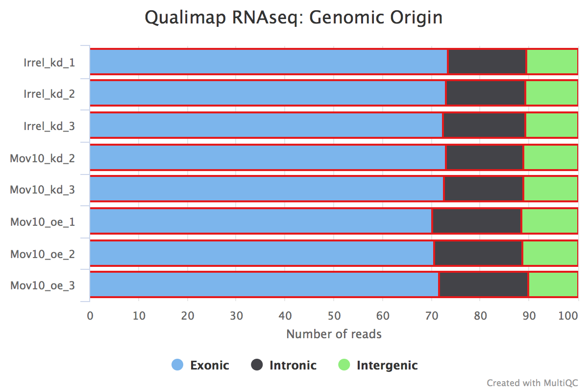

Approximate time: 30 minutes

## Documenting results and gathering QC metrics

As you go through the RNA-seq workflow (or any data analysis workflow), it is important to document the parameters you are using to run the analysis, in addition it is very important to document the results at every step, or some metric that speaks to the results. Evaluating these is a form of QC and it will enable you to identify any issues with the data and/or the parameters you are using, as well as alert you to the presence of contamination or systematic biases, etc.  

With the RNA-seq workflow there are several metrics that you can evaluate, but below are 3 important ones that you should keep track of for each sample:

* number of raw reads
* percentage of reads aligned to genome
* percentage of reads associated with genes 

An important QC step is to make sure these metrics are consistent across the samples for a given experiment, and any outliers should be investigated further.

Manually tracking these metrics is tedious and prone to errors. Several tools exist that help you with the documentation and QC assessment. Some of these also have really nice visualizations to easily identify any issues, e.g. [FastQC](https://www.bioinformatics.babraham.ac.uk/projects/fastqc/), [Qualimap](http://qualimap.bioinfo.cipf.es/doc_html/index.html), [MultiQC](http://multiqc.info/). Some of these tools have some overlap, but tend to focus on QC related to a specific step in the RNA-seq workflow, whereas MultiQC is able to make a report from the output of many different tools (for RNA-seq analysis and other NGS workflows) and is a little simpler to use.

### Tracking and aggregating results from workflow tools with *MultiQC*

Today we will be using MultiQC, which aggregates results from several tools and generates a single HTML report with plots to visualize and compare various QC metrics between the samples.

MultiQC can generate this report from 36 different bioinformatics tools, and these tools span various NGS analyses, e.g., basic QC, RNA-seq, ChIP-seq, variant calling, genome annotation, etc. Today we are going to use it to aggregate information from the results of [FastQC](http://multiqc.info/docs/#fastqc), [STAR](http://multiqc.info/docs/#star), [Qualimap](http://multiqc.info/docs/#qualimap), and [salmon](http://multiqc.info/docs/#salmon). MultiQC can parse the information from specific output files from each of these tools and the manual page specifies the required output from each of the tools that should be used as input to MultiQC.

We are going to start by creating a directory in the `~/rnaseq/results/` directory called `multiqc_report`, and navigating to it. You should already be in the `~/rnaseq/` directory.

```bash
$ mkdir results/multiqc_report

$ cd results/multiqc_report

$ module load gcc/6.2.0 python/2.7.12 multiqc/1.5
```

Next, we are going to run multiQC on the following 4 outputs from our workflow:

* `.zip` files from FastQC
* `.Log.final.out` files from STAR
* `.qualimap` files from Qualimap
* `.salmon` directories from salmon

Generally we run multiQC to explore our samples and compare metrics across samples. So far, we have only run FastQC, STAR, Qualimap, and salmon on the single `Mov10_oe_1` file. Therefore, to accurately compare QC metrics across samples, we ran these tools on the FASTQ files for the full dataset for each of our samples. 


Now, let's run multiQC!

```bash
$ multiqc -n multiqc_report_rnaseq \
/n/groups/hbctraining/ngs-data-analysis-longcourse/rnaseq/snapshots/full_dataset_results/fastqc/*zip \
/n/groups/hbctraining/ngs-data-analysis-longcourse/rnaseq/snapshots/full_dataset_results/STAR/*Log.final.out \
/n/groups/hbctraining/ngs-data-analysis-longcourse/rnaseq/snapshots/full_dataset_results/qualimap/* \
/n/groups/hbctraining/ngs-data-analysis-longcourse/rnaseq/snapshots/full_dataset_results/salmon/*salmon
```

> If you want to save the output on the terminal into a log file, you can use `2>` operator to redirect it to a file.

The multiQC report is relatively quick to generate and provides a really clear method for comparing the samples to determine consistency, and to identify problematic samples.

The output of multiQC is 1 HTML file and a data folder. Let's transfer the interactive HTML report over to our laptops using **FileZilla** and visualize the outputs of the 4 tools we used to generate the report.

## Assessing the quality control metrics

The main metrics to explore first are:

* number of raw reads or total reads
* percentage of reads aligned to genome
* percentage of reads associated with genes 

To view the total number of reads, we may need to configure the columns, which is a button just underneath the 'General Statistics' heading. 


We are going to choose the following columns:


The descriptions of each of these columns are also helpful in interpretation of the table. Upon perusal of the table, we can see input from FastQC, STAR, Qualimap and salmon. The total number of raw reads is given in the `M Seqs` column on the far right of the table. 

STAR gives information about *uniquely mapping reads* in the `%Aligned` column. A good quality sample will have **at least 75% of the reads uniquely mapped**. Once values start to drop lower than 60% it's advisable to start troubleshooting. The lower the number of uniquely mapping reads means the higher the number of reads that are mapping to multiple locations. 

The 'STAR: Alignment Scores' plot visually represents much of this information. The % uniquely mapping, multimapping, and unmapped reads can be easily compared between samples to get a nice overview of the quality of the samples.


> NOTE: The thresholds suggested above will vary depending on the organism that you are working with. Much of what is discussed here is in the context of working with human or mouse data. For example, 75% of mapped reads holds true only if the genome is good or mature. For badly assembled genomes we may not observe a high mapping rate, even if the actual sequence sample is good.

Salmon also gives a `%Aligned` column representing the percent of mapped reads. We will be using the salmon abundance estimates for downstream analysis, so these numbers are particularly important for our analysis.


### Complexity

The complexity of the RNA-seq library can be explored a bit with the `%Dups` column. If a large percentage of the library is duplicated, then this could indicate either a library of low complexity or over-amplification. If there are differences between libraries in the complexity or amplification, then this can lead to biases in the data, such as differing %GC content.

### Exploring biases

Within this report we can also explore the bias metrics output by Qualimap and FastQC. The `5'-3' bias` column denotes whether our data has any 5' or 3' biases. These biases could be due to RNA degradation or sample preparation techniques. Generally, we should explore our data more if we have biases approaching 0.5 or 2. 

The transcript position plot can also help identify 5' or 3' bias in addition to any other coverage issues. We generally expect roughly even coverage.


In addition, we can see whether our different samples have differences in `%GC`. A GC bias in our data can present as differences in composition of %GC. These biases could be caused by low-complexity libraries, differences in amplification, or library-specific causes.

### Contamination

We can also identify problems with our library or contamination of our samples by looking at the percent of reads that are exonic, intronic or intergenic. High levels of intergenic reads is indicative of DNA contamination (>30%). Also, if a polyA selection of messenger RNAs was performed, then high percentages of intronic reads would be concerning. 



Generally in a good library, we expect over 60% of reads to map to exons for mouse and human organisms. For other organisms the percentage depends on how well annotated is the genome.

### Fragment length distribution 

The auxiliary directory generated from Salmon will contain a file called `fld.gz`. This file contains an approximation of the observed fragment length distribution. This is more meaningful for paired-end data where the length can be estimated based on the fact that we have reads from both ends of the fragment. These plots can be compared to what we expect based on our knowledge of the size selection step performed during the library preparation stage.

> **NOTE:** For single end data (as we have), Salmon reports a fixed insert length distribution assumption and so the values are identical for all samples. When values are identical then the plot will only be possible to get a tooltip for the topmost plotted sample, hence the reason we only observe one of the Mov10_oe samples.


---
*This lesson has been developed by members of the teaching team at the [Harvard Chan Bioinformatics Core (HBC)](http://bioinformatics.sph.harvard.edu/). These are open access materials distributed under the terms of the [Creative Commons Attribution license](https://creativecommons.org/licenses/by/4.0/) (CC BY 4.0), which permits unrestricted use, distribution, and reproduction in any medium, provided the original author and source are credited.*
