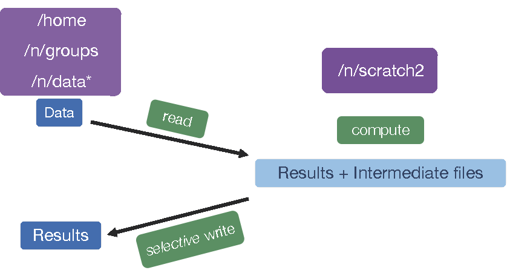

## Learning Objectives:

* Automate a workflow by grouping a series of sequential commands into a script
* Modify and submit the workflow script to the cluster

## Automating the analysis path from Sequence reads to Count matrix

Once you have optimized all the tools and parameters using a single sample (likely using an interactive session), you can write a script to run the whole workflow on all the samples in parallel.

This will ensure that you run every sample with the exact same parameters, and will enable you to keep track of all the tools and their versions. In addition, the script is like a lab notebook; in the future, you (or your colleagues) can go back and check the workflow for methods, which enables efficiency and reproducibility.

Before we start with the script, let's check how many cores our interactive session has by using `sacct`. 

```bash
$ sacct
```

We need to have an interactive session with 6 cores, if you already have one you are set. If you have a session with fewer cores then `exit` out of your current interactive session and start a new one with `-c 6`.

```bash
$ srun --pty -p interactive -t 0-12:00 -c 6 --mem 8G --reservation=HBC /bin/bash
```

### Using "scratch space"

Before we get started, let's talk a little bit about how data are stored on O2. O2, like many clusters, has several different storage options; each of which has different amounts of space available, and is differently backed up. One filesystem is the `/n/scratch2/` space. This directory has a lot of shared disk space available but, the files are not backed up and they will be deleted if left "untouched" for more than 30 days.

By design `/n/scratch2/` is to be used for intermediate files that are created during any analysis. An example is in the schematic below. 

<p align="center">

</p>

Today, we are going to learn how to use `/n/scratch2/` as we work on automating our workflow. In this context, we will be maintaining our data in our (backed up) home directories, but all of the output files will be in scratch space. When we are done, we can copy over only those output files that are essential.

To get started, let's create a folder for ourselves in `/n/scratch2/` and within that a folder for this RNA-seq analysis.

```bash
mkdir -p /n/scratch2/$USER/rnaseq_hbc-workshop/
```

When we create our script, we will make sure that all of the analysis output gets saved in the `/n/scratch2/$USER/rnaseq_hbc-workshop/` folder.

### More Flexibility with variables

We can write a shell script that will run on a specific file, but to make it more flexible and efficient we would prefer that it lets us give it an input fastq file when we run the script. To be able to provide an input to any shell script, we need to use **Positional Parameters**.

For example, we can refer to the components of the following command as numbered variables **within** the actual script:

```bash
# * DO NOT RUN *
sh  run_rnaseq.sh  input.fq  input.gtf  12
```

`$0` => run_rnaseq.sh

`$1` => input.fq

`$2` => input.gtf

`$3` => 12

The variables $1, $2, $3,...$9 and so on are **positional parameters** in the context of the shell script, and can be used within the script to refer to the files/number specified on the command line. Basically, the script is written with the expectation that $1 will be a fastq file and $2 will be a GTF file, and so on.

*There can be virtually unlimited numbers of inputs to a shell script, but it is wise to only have a few inputs to avoid errors and confusion when running a script that used positional parameters.*

> [This is an example of a simple script that used the concept of positional parameters and the associated variables](http://steve-parker.org/sh/eg/var3.sh.txt). You should try this script out after the class to get a better handle on positional parameters for shell scripting.

Let's use this new concept in the script we are writing. We want the first positional parameter ($1) to be the name of our fastq file. We could just use the variable `$1` throughout the script to refer to the fastq file, but this variable name is not intuitive, so we want to create a new variable called `fq` and copy the contents of `$1` into it.

First, we need to start a new script called `rnaseq_analysis_on_input_file.sh` in the `~/rnaseq/scripts/` directory:

```bash
$ cd ~/rnaseq/scripts/

$ vim rnaseq_analysis_on_input_file.sh
```

```bash
#!/bin/bash/

# change directories to /n/scratch2/ so that all the analysis is stored there.
cd /n/scratch2/$USER/rnaseq_hbc-workshop/

# initialize a variable with an intuitive name to store the name of the input fastq file

fq=$1
```

> When we set up variables we do not use the `$` before it, but when we *use the variable*, we always have to have the `$` before it. >
>
> For example: 
>
> initializing the `fq` variable => `fq=$1`
>
> using the `fq` variable => `fastqc $fq`

To ensure that all the output files from the workflow are properly named with sample IDs we should extract the "base name" (or sample ID) from the name of the input file.

```
# grab base of filename for naming outputs

base=`basename $fq .subset.fq`
echo "Sample name is $base"           
```

> **Remember `basename`?**
>
> 1. the `basename` command: this command takes a path or a name and trims away all the information before the last `\` and if you specify the string to clear away at the end, it will do that as well. In this case, if the variable `$fq` contains the path *"~/rnaseq/raw_data/Mov10_oe_1.subset.fq"*, `basename $fq .subset.fq` will output "Mov10_oe_1".
> 2. to assign the value of the `basename` command to the `base` variable, we encapsulate the `basename...` command in backticks. This syntax is necessary for assigning the output of a command to a variable.

Next we want to specify how many cores the script should use to run the analysis. This provides us with an easy way to modify the script to run with more or fewer cores without have to replace the number within all commands where cores are specified.

```
# specify the number of cores to use

cores=6
```
Next we'll initialize 3 more variables named `genome`, `transcriptome` and `gtf`, these will contain the paths to where the reference files are stored. This makes it easier to modify the script for when you want to use a different genome, i.e. you'll just have to change the contents of these variable at the beginning of the script.

```
# directory with the genome and transcriptome index files + name of the gene annotation file

genome=/n/groups/hbctraining/intro_rnaseq_hpc/reference_data_ensembl38/ensembl38_STAR_index
transcriptome=/n/groups/hbctraining/rna-seq_2019_02/reference_data/salmon.ensembl38.idx.09-06-2019
gtf=/n/groups/hbctraining/intro_rnaseq_hpc/reference_data_ensembl38/Homo_sapiens.GRCh38.92.1.gtf
```

We'll create output directories, but with the `-p` option. This will make sure that `mkdir` will create the directory only if it does not exist, and it won't throw an error if it does exist.

```
# make all of the output directories
# The -p option means mkdir will create the whole path if it 
# does not exist and refrain from complaining if it does exist

mkdir -p results/fastqc/
mkdir -p results/STAR/
mkdir -p results/qualimap/
mkdir -p results/salmon/
```

Now that we have already created our output directories, we can now specify variables with the path to those directories both for convenience but also to make it easier to see what is going on in a long command.

```
# set up output filenames and locations

fastqc_out=results/fastqc/
align_out=results/STAR/${base}_
align_out_bam=results/STAR/${base}_Aligned.sortedByCoord.out.bam
qualimap_out=results/qualimap/${base}.qualimap
salmon_out=results/salmon/${base}.salmon
salmon_mappings=results/salmon/${base}_salmon.out
```

### Keeping track of tool versions

All of our variables are now staged. Next, let's make sure all the modules are loaded. This is also a good way to keep track of the versions of tools that you are using in the script:

```
# set up the software environment

module load fastqc/0.11.3
module load gcc/6.2.0  
module load star/2.7.0a
module load samtools/1.3.1
unset DISPLAY
export PATH=/n/app/bcbio/dev/anaconda/bin:$PATH
```

### Preparing for future debugging

In the script, it is a good idea to use `echo` for debugging. `echo` basically displays the string of characters specified within the quotations. When you have strategically place `echo` commands specifying what stage of the analysis is next, in case of failure you can determine the last `echo` statement displayed to troubleshoot the script.

```
echo "Processing file $fq"
```

> You can also use `set -x`:
>
> `set -x` is a debugging tool that will make bash display the command before executing it. In case of an issue with the commands in the shell script, this type of debugging lets you quickly pinpoint the step that is throwing an error. Often, tools will display the error that caused the program to stop running, so keep this in mind for times when you are running into issues where this is not available.
> You can turn this functionality off by saying `set +x`

### Running the tools

```
echo "Starting QC for $base"

# Run FastQC and move output to the appropriate folder
fastqc -o $fastqc_out $fq


# Run STAR
STAR --runThreadN $cores --genomeDir $genome --readFilesIn $fq --outFileNamePrefix $align_out --outSAMtype BAM SortedByCoordinate --outSAMunmapped Within --outSAMattributes Standard

# Run Qualimap
qualimap rnaseq \
-outdir $qualimap_out \
-a proportional \
-bam $align_out_bam \
-p strand-specific-reverse \
-gtf $gtf \
--java-mem-size=8G

# Run salmon

echo "Starting Salmon run for $base"

salmon quant -i $transcriptome \
-p $cores \
-l A \
-r $fq \
-o $salmon_out \
--seqBias \
--useVBOpt
```

### Last addition to the script

It is best practice to have the script **usage** specified at the top any script. This should have information such that when your future self, or a co-worker, uses the script they know what it will do and what input(s) are needed. For our script, we should have the following lines of comments right at the top after `#!/bin/bash/`:

```
# This script takes a fastq file of RNA-seq data, runs FastQC, STAR, Qualimap and Salmon.
# USAGE: sh rnaseq_analysis_on_input_file.sh <name of fastq file>
```

It is okay to specify this after everything else is set up, since you will have most clarity about the script only once it is fully done.

### Saving and running script

To transfer the contents of the script to O2, you can copy and paste the contents into a new file using `vim`. 

```bash
$ cd ~/rnaseq/scripts/

$ vim rnaseq_analysis_on_input_file.sh 
```
> *Alternatively, you can save the script on your computer and transfer it to `~/rnaseq/scripts/` using FileZilla.*


We should all have an interactive session with 6 cores, so we can run the script as follows:

```bash
$ cd ..     # pwd should be ~/rnaseq/

$ sh scripts/rnaseq_analysis_on_input_file.sh ~/rnaseq/raw_data/Mov10_oe_1.subset.fq
```

## Running the script to submit jobs in parallel to the SLURM scheduler

The above script will run in an interactive session **one file at a time**. But the whole point of writing this script was to run it on all files at once. How do you think we can do this?

To run the above script **"in serial"** for all of the files on a worker node via the job scheduler, we can create a separate submission script that will need 2 components:

1. **SLURM directives** at the **beginning** of the script. This is so that the scheduler knows what resources we need in order to run our job on the compute node(s).
2. a **`for`** loop that iterates through and runs the above script for all the fastq files.

Below is what this second script (`rnaseq_analysis_on_allfiles.slurm`) would look like **\[DO NOT RUN THIS\]**:

```
#!/bin/bash

#SBATCH -p medium 		# partition name
#SBATCH -t 0-6:00 		# hours:minutes runlimit after which job will be killed
#SBATCH -c 6 		# number of cores requested -- this needs to be greater than or equal to the number of cores you plan to use to run your job
#SBATCH --mem 8G
#SBATCH --job-name STAR_mov10 		# Job name
#SBATCH -o %j.out			# File to which standard out will be written
#SBATCH -e %j.err 		# File to which standard err will be written

# this `for` loop, will take the fastq files as input and run the script for all of them one after the other. 
for fq in ~/rnaseq/raw_data/*.fq
do
  echo "running analysis on $fq"
  sh ~/rnaseq/scripts/rnaseq_analysis_on_input_file.sh $fq
done
```

**But we don't want to run the analysis on these 6 samples one after the other!** We want to run them "in parallel" as 6 separate jobs. 

**Note:** If you create and run the above script, or something similar to it, i.e. with SLURM directives at the top, you should give the script name `.run` or `.slurm` as the extension. This will make it obvious that it is meant to submit jobs to the SLURM scheduler. 

***
**Exercise**

How would you run `rnaseq_analysis_on_allfiles.slurm`, i.e. the above script?

***

## Parallelizing the analysis for efficiency

Parallelization will save you a lot of time with real (large) datasets. To parallelize our analysis, we will still need to write a second script that will call the script we just wrote that takes a fastq file as input (rnaseq_analysis_on_input_file.sh). We will still use a `for` loop, but we will be creating a regular shell script and we will be specifying the SLURM directives differently. 

Use `vim` to start a new shell script called `rnaseq_analysis_on_allfiles-for_slurm.sh`: 

```bash
$ vim rnaseq_analysis_on_allfiles_for-slurm.sh
```

This script loops through the same files as in the previous (demo) script, but the command being submitted within the `for` loop is `sbatch` with SLURM directives specified on the same line:

```bash
#! /bin/bash

for fq in ~/rnaseq/raw_data/*.fq
do

sbatch -p short -t 0-2:00 -c 6 --job-name rnaseq-workflow --mem 8G --wrap="sh ~/rnaseq/scripts/rnaseq_analysis_on_input_file.sh $fq"
sleep 1	# wait 1 second between each job submission
  
done
```
> Please note that after the `sbatch` directives the command `sh ~/rnaseq/scripts/rnaseq_analysis_on_input_file.sh $fq` is in quotes.

```bash
$ cd ~/rnaseq/scripts/
$ sh rnaseq_analysis_on_allfiles_for-slurm.sh
```

What you should see on the output of your screen would be the jobIDs that are returned from the scheduler for each of the jobs that your script submitted.

You can use `O2sacct` to check progress. And we can check if there are any additional files in our analysis folder.

```bash
$ O2sacct

$ ls -l /n/scratch2/$USER/rnaseq_hbc-workshop/
```

Don't forget about the `scancel` command, should something go wrong and you need to cancel your jobs.

> **NOTE:** All job schedulers are similar, but not the same. Once you understand how one works, you can transition to another one without too much trouble. They all have their pros and cons which are considered by the system administrators when picking one for a given HPC environment. Some examples of other job schedulers are LSF, SGE, PBS/Torque.

---
*This lesson has been developed by members of the teaching team at the [Harvard Chan Bioinformatics Core (HBC)](http://bioinformatics.sph.harvard.edu/). These are open access materials distributed under the terms of the [Creative Commons Attribution license](https://creativecommons.org/licenses/by/4.0/) (CC BY 4.0), which permits unrestricted use, distribution, and reproduction in any medium, provided the original author and source are credited.*

* *The materials used in this lesson was derived from work that is Copyright © Data Carpentry (http://datacarpentry.org/). 
All Data Carpentry instructional material is made available under the [Creative Commons Attribution license](https://creativecommons.org/licenses/by/4.0/) (CC BY 4.0).*
