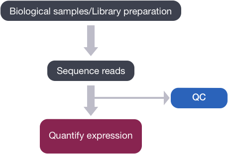
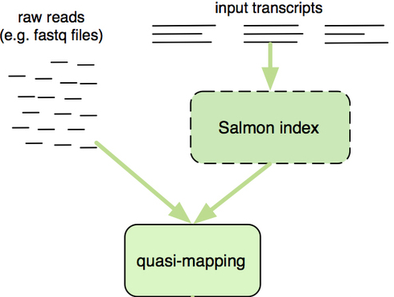

Contributors: Mary Piper and Meeta Mistry

Approximate time: 1.25 hours

## Learning Objectives

* Explore using lightweight algorithms to quantify reads to abundance estimates
* Understand how Salmon performs quasi-mapping and transcript abundance estimation

## Lightweight alignment and quantification of gene expression

Now that we have explored the quality of our raw reads, we can move on to quantifying expression at the transcript level. The goal of this step is to identify from which transcript each of the reads originated from and the total number of reads associated with each transcript.

<p align="center">

</p>

Tools that have been found to be most accurate for this step in the analysis are referred to as lightweight alignment tools, which include [Kallisto](https://pachterlab.github.io/kallisto/about), [Sailfish](http://www.nature.com/nbt/journal/v32/n5/full/nbt.2862.html) and [Salmon](https://combine-lab.github.io/salmon/); each working slightly different from one another. We will focus on Salmon for this workshop, which is the successor of Sailfish. However, Kallisto is an equally good choice with similar performance metrics for speed and accuracy.

Common to all of these tools is that **base-to-base alignment of the reads is avoided**, which is the time-consuming step of older splice-aware alignment tools such as STAR and HISAT2. These lightweight alignment tools **provide quantification estimates much faster than older tools** (typically more than 20 times faster) with **improvements in accuracy** [[1](https://genomebiology.biomedcentral.com/articles/10.1186/s13059-015-0734-x)]. These transcript expression estimates, often referred to as 'pseudocounts' or 'abundance estimates', can be aggregated to the gene level for use with differential gene expression tools like [DESeq2](http://bioconductor.org/packages/devel/bioc/vignettes/DESeq2/inst/doc/DESeq2.html) or the estimates can be used directly for isoform-level differential expression using a tool like [Sleuth](http://www.biorxiv.org/content/biorxiv/early/2016/06/10/058164.full.pdf). 

## Salmon

[Salmon](http://salmon.readthedocs.io/en/latest/salmon.html#using-salmon) uses the reference transcriptome (in FASTA format) and raw sequencing reads (in FASTQ format) as input to perform both mapping and quantification of the reads.

The "quasi-mapping" approach utilized by Salmon **requires a reference index** to determine the position and orientation information for where the fragments best map prior to quantification [[2](https://academic.oup.com/bioinformatics/article/32/12/i192/2288985/RapMap-a-rapid-sensitive-and-accurate-tool-for)]. The reference index essentially provides the transcriptome in a format that is **easily and rapidly searchable**. Therefore, it will allow us to quickly find the positions in the transcriptome where each of the reads originated.

> **NOTE:** Since we are searching against the transcriptome, Salmon would not be the appropriate tool to use if trying to detect **novel genes or isoforms, intron retention events, or other methods that require annotations not present in the transcriptome**.

<p align="center">

</p>

*Image credit: [RNA-Seq Blog](https://www.rna-seqblog.com/salmon-fast-and-bias-aware-quantification-of-transcript-expression/)*

### **Creating the transcriptome index** 

This step involves creating an index to evaluate the sequences for all possible unique sequences of length k (k-mer) in the **transcriptome**, which includes all known transcripts/ splice isoforms for all genes.

**The index helps creates a signature for each transcript in our reference transcriptome.** The Salmon index has two components:

- a suffix array (SA) of the reference transcriptome
- a hash table to map each transcript in the reference transcriptome to it's location in the SA (is not required, but improves the speed of mapping drastically)

To create the transcriptome index with Salmon, let's start an interactive session and create a new directory in our `results` folder for the Salmon output:

```bash
$ srun --pty -p interactive -t 0-12:00 --mem 8G --reservation=HBC /bin/bash

$ mkdir ~/rnaseq/results/salmon

$ cd ~/rnaseq/results/salmon
```   

Salmon is not available as a module on O2, but it is installed as part of the bcbio pipeline. Therefore, we need to add the appropriate path (`/n/app/bcbio/tools/bin/`) in our `$PATH` variable so that we can use it by simply typing in `salmon`. This directory contains executables for many tools useful for NGS analysis. We can add this location by including an `export` command to do this at the end of the `.bashrc` file, this will make it so that when you start a new shell session the location will always be in your path. 

Open the `.bashrc` file using `vim` and at the end of the file add the export command that adds a specific location to the list in `$PATH`. 

```bash
$ vim ~/.bashrc

# at the end of the file type in the following:
export PATH=/n/app/bcbio/tools/bin:$PATH

# Don't forget the ":" between the full path and the "$PATH"!
```

Exit `vim` and re-read the `.bashrc` file using the `source` command:

```bash
$ source ~/.bashrc

$ echo $PATH
```

Now, we could create the index using the `salmon index` command as detailed below; however, we are not going to run this in class as it can take a few minutes to run. 
The parameters for the indexing step are as follows:

- **`-t`:** the path to the transcriptome (in FASTA format)
- **`-i`:** the path to the folder to store the indices generated
- **`-k`:** the length of kmer to use to create the indices (will output all sequences in transcriptome of length k)
    
```bash
## DO NOT RUN THIS CODE
$ salmon index \
-t /n/groups/hbctraining/rna-seq_2019_02/reference_data/Homo_sapiens.GRCh38.cdna.all.fa \
-i salmon_index \
-k 31
```	

>
> **NOTE:** Default for salmon is -k 31, so we do not need to include these parameters in the index command. However, the kmer default of 31 is optimized for 75bp or longer reads, so if your reads are shorter, you may want a smaller kmer to use with shorter reads (kmer size needs to be an odd number).

> **Accessing transcriptome data:** We generated the index from transcript sequences for human obtained from the [Ensembl ftp site](https://useast.ensembl.org/info/data/ftp/index.html) with the following commands:
>
> ```bash
> # Download from the FTP server
> $ wget ftp://ftp.ensembl.org/pub/release-95/fasta/homo_sapiens/cdna/Homo_sapiens.GRCh38.cdna.all.fa.gz
> 
> # Decompress the FASTA file
> $ gzip -d Homo_sapiens.GRCh38.cdna.all.fa.gz
> ```
	
***

**Exercise:**
	
In your RNA-seq experiment, you expressed a GFP transgene in your mice, and you would like to quantify the expression of GFP. We know that the sequence is not present in the human transcriptome. What would you do?

- **a.** Try laboratory techniques like quantitative PCR to act as a proxy for expression level
- **b.** Add the sequence of the GFP transcript to the FASTA reference file
- **c.** Manually search for and count the number of times the GFP transcript is present in the read files for each sample
- **d.** Feel defeated and accept that there is no valid way to do this

***
	
### **Quasi-mapping and quantification** 

The quasi-mapping approach estimates where the reads best map to on the transcriptome through identifying where informative sequences within the read map to instead of performing base-by-base alignment. The quasi-mapping approach is described below, with details provided by the Rapmap tool [[3](https://academic.oup.com/bioinformatics/article/32/12/i192/2288985/RapMap-a-rapid-sensitive-and-accurate-tool-for)], which provides the underlying algorithm for the quasi-mapping.

- **Step 1: Quasi-mapping**

	
	
	>RapMap: a rapid, sensitive and accurate tool for mapping RNA-seq reads to transcriptomes. A. Srivastava, H. Sarkar, N. Gupta, R. Patro. Bioinformatics (2016) 32 (12): i192-i200.
	
	To determine the best mapping for each read/fragment, the quasi-mapping procedure performs the following steps [[2](https://academic.oup.com/bioinformatics/article/32/12/i192/2288985/RapMap-a-rapid-sensitive-and-accurate-tool-for)]:

	1. The read is scanned from left to right until a k-mer that appears in the hash table is discovered.
	2. The k-mer is looked up in the hash table and the SA intervals are retrieved, giving all suffixes containing that k-mer
	3. Similar to STAR, the maximal matching prefix (MMP) is identified by finding the longest read sequence that exactly matches the reference suffixes.
	4. We could search for the next MMP at the position following the MMP, but often natural variation or a sequencing error in the read is the cause of the mismatch from the reference, so the beginning the search at this position would likely return the same set of transcripts. Therefore, Salmon identifies the next informative position (NIP), by **skipping ahead 1 k-mer**. 
	5. This process is repeated until the end of the read.
	6. The final mappings are generated by determining the set of transcripts appearing in all MMPs for the read. The transcripts, orientation and transcript location are output for each read.
	
	
		>
		> **NOTE:** If there are k-mers in the reads that are not in the index, they are not counted. As such, trimming is not required when using this method. Accordingly, if there are reads from transcripts not present in the reference transcriptome, they will not be quantified. Quantification of the reads is only as good as the quality of the reference transcriptome.

- **Step 2: Abundance quantification**

	After determining the best mapping for each read/fragment using the quasi-mapping method, salmon will generate the final transcript abundance estimates after modeling sample-specific parameters and biases. Note that reads/fragments that map equally well to more than one transcript will have the count divided between all of the mappings; thereby not losing information for the various gene isoforms.
	
	Instead of only counting the number of reads/fragments mapping to each of the transcripts, Salmon uses multiple complex modeling approaches, like Expectation Maximization (EM) to estimate the transcript abundances while correcting the abundance estimates for any sample-specific biases/factors [[4](http://www.nature.com.ezp-prod1.hul.harvard.edu/nmeth/journal/v14/n4/full/nmeth.4197.html?WT.feed_name=subjects_software&foxtrotcallback=true)]. Sample-specific bias models are helpful when needing to account for known biases present in RNA-Seq data including:

	- GC bias
	- positional coverage biases
	- sequence biases at 5' and 3' ends of the fragments
	- fragment length distribution
	- strand-specific methods

	If not accounted for, these biases can lead to unacceptable false positive rates in differential expression studies [[1](http://salmon.readthedocs.io/en/latest/salmon.html#quasi-mapping-based-mode-including-lightweight-alignment)]. The **Salmon algorithm can learn these sample-specific biases and account for them in the transcript abundance estimates**. Generally, this step results in more accurate transcript abundance estimation.

	To perform the quasi-mapping and transcript abundance quantification, we can run the `salmon quant` command. The parameters for the command are described below (more information on parameters can be found [here](http://salmon.readthedocs.io/en/latest/salmon.html#id5)):

	* `-i`: specify the location of the index directory; for us it is `/n/groups/hbctraining/rna-seq_2019_02/reference_data/salmon.ensembl38.idx.09-06-2019`
	* `-l A`: Format string describing the library. `A` will automatically infer the most likely library type (more info available [here](http://salmon.readthedocs.io/en/latest/salmon.html#what-s-this-libtype))
	* `-r`: sample file
	* `-o`: output quantification file name
	* `--useVBOpt`: use variational Bayesian EM algorithm rather than the ‘standard EM’ to optimize abundance estimates (more accurate) 
	* `--seqBias` will enable it to learn and correct for sequence-specific biases in the input data
	* `--validateMappings`: developed for finding and scoring the potential mapping loci of a read by performing base-by-base alignment of the reads to the potential loci, scoring the loci, and removing loci falling below a threshold score. This option improves the sensitivity and specificity of the mapping.


	To run the quantification step on a single sample we have the command provided below. Let's try running it on our subset sample for `Mov10_oe_1.subset.fq`:

	```bash
	$ salmon quant -i /n/groups/hbctraining/rna-seq_2019_02/reference_data/salmon.ensembl38.idx.09-06-2019 \
	 -l A \
 	-r ~/rnaseq/raw_data/Mov10_oe_1.subset.fq \
 	-o Mov10_oe_1.subset.salmon \
 	--useVBOpt \
	--seqBias \
	--validateMappings
	```
	
	> **NOTE:** Mapping validation can generally improve both the sensitivity and specificity of mapping, with only a moderate increase in use of computational resources. Unless there is a specific reason to do this (e.g. testing on clean simulated data), `--validateMappings` is generally recommended.

	> **Paired-end data:** If using paired-end reads, then the command would require both sets of reads to be given:
`salmon quant -i transcripts_index -l A -1 reads1.fq -2 reads2.fq -o transcripts_quant`
	> 
	> **RNA-seq bias correctoin:** To have Salmon correct for RNA-Seq biases you will need to specify the appropriate parameters when you run it. As noted, when describing the FASTQC results, with RNA-seq data you will always observe sequence-specific biases due to the random hexamer priming and so we would always want to have that correction turned on. Before using the remaining parameters it is advisable to assess your data using tools like [Qualimap](http://qualimap.bioinfo.cipf.es/) to look specifically for the presence of these biases in your data and decide on which parameters would be appropriate. 
	> 
	> To correct for the various sample-specific biases you could add the following parameters to the Salmon command:
	>
	> * `--gcBias` to learn and correct for fragment-level GC biases in the input data
	> * `--posBias` will enable modeling of a position-specific fragment start distribution
	>

## Salmon output

You should see a new directory has been created that is named by the string value you provided in the `-o` command. Take a look at what is contained in this directory:

    $ ls -l Mov10_oe_1.subset.salmon/
    
There is a logs directory, which contains all of the text that was printed to screen as Sailfish was running. Additionally, there is a file called `quant.sf`. 

This is the **quantification file** in which each row corresponds to a transcript, listed by Ensembl ID, and the columns correspond to metrics for each transcript:

```bash
Name    Length  EffectiveLength TPM     NumReads
ENST00000632684.1       12      3.00168 0       0
ENST00000434970.2       9       2.81792 0       0
ENST00000448914.1       13      3.04008 0       0
ENST00000415118.1       8       2.72193 0       0
ENST00000631435.1       12      3.00168 0       0
ENST00000390567.1       20      3.18453 0       0
ENST00000439842.1       11      2.95387 0       0

....

```

*  The first two columns are self-explanatory, the **name** of the transcript and the **length of the transcript** in base pairs (bp). 
*  The **effective length** represents the various factors that effect the length of transcript (i.e degradation, technical limitations of the sequencing platform)
* Salmon outputs 'pseudocounts' or 'abundance estimates' which predict the relative abundance of different isoforms in the form of three possible metrics (FPKM, RPKM, and TPM). **TPM (transcripts per million)** is a commonly used normalization method as described in [[1]](http://www.ncbi.nlm.nih.gov/pmc/articles/PMC2820677/) and is computed based on the effective length of the transcript. **We do NOT recommend FPKM or RPKM**.
* Estimated **number of reads**, which is the estimate of the number of reads drawn from this transcript given the transcript’s relative abundance and length)

 
## Running Salmon on multiple samples 

We just ran Salmon on a single sample, but we would like to run this on **all samples**. To do so, we will need to create a job submission script.

> *NOTE:* We are iterating over FASTQ files in the **`raw_data` directory**.

### Create a job submission script to run Salmon in serial

Since Salmon is only able to take a single file as input, one way in which we can do this is to use a 'for loop' to run Salmon on all samples in serial. What this means is that Salmon will process the dataset one sample at a time.

Let's start by opening up a script in `vim`:

```
$ vim salmon_all_samples.sbatch
```

Let's start our script with a **shebang line followed by SBATCH directives which describe the resources we are requesting from O2**. We will ask for 6 cores and take advantage of Salmon's multi-threading capabilities. 

Next we can **create a for loop to iterate over all FASTQ samples**. Inside the loop we will create a variable that stores the prefix we will use for naming output files, then we run Salmon. 

The final script is shown below:

```
#!/bin/bash

#SBATCH -p short 
#SBATCH -c 6 
#SBATCH -t 0-12:00 
#SBATCH --mem 8G 
#SBATCH --job-name salmon_in_serial 
#SBATCH -o %j.out 
#SBATCH -e %j.err
#SBATCH --reservation=HBC

cd ~/rnaseq/results/salmon

for fq in ~/rnaseq/raw_data/*.fq

do

# create a prefix
base=`basename $fq .fq`

# run salmon
salmon quant -i /n/groups/hbctraining/rna-seq_2019_02/reference_data/salmon.ensembl38.idx.09-06-2019 \
 -l A \
 -r $fq \
 -p 6 \
 -o $base.salmon \
 --seqBias \
 --useVBOpt \
 --numBootstraps 30 \
 --validateMappings

done

```

Note, that we are **adding a couple of new parameters**: 

* `-p`: specifies the number of processors or cores we would like to use for **multithreading** 
* `--numBootstraps`: specifies computation of bootstrapped abundance estimates. **Bootstraps are required for isoform level differential expression analysis for estimation of technical variance**. 
	
> _**NOTE:** `--numBootstraps` is necessary if performing **isoform-level differential expression analysis** with Sleuth, but not for gene-level differential expression analysis. Due to the statistical procedure required to assign reads to gene isoforms, in addition to the random processes underlying RNA-Seq, there will be **technical variability in the abundance estimates** output from the pseudo-alignment tool [[2](https://rawgit.com/pachterlab/sleuth/master/inst/doc/intro.html), [3](https://www.nature.com/articles/nmeth.4324)] for the isoform level abundance estimates (not necessary for gene-level estimates). Therefore, **we would need technical replicates to distinguish technical variability from the biological variability** for gene isoforms._
>
> _The bootstraps estimate technical variation per gene by calculating the abundance estimates for all genes using a different sub-sample of reads during each round of bootstrapping. The variation in the abundance estimates output from each round of bootstrapping is used for the estimation of the technical variance for each gene._

Save and close the script. This is now ready to run.

```
$ sbatch salmon_all_samples.sbatch
```

---

*This lesson has been developed by members of the teaching team at the [Harvard Chan Bioinformatics Core (HBC)](http://bioinformatics.sph.harvard.edu/). These are open access materials distributed under the terms of the [Creative Commons Attribution license](https://creativecommons.org/licenses/by/4.0/) (CC BY 4.0), which permits unrestricted use, distribution, and reproduction in any medium, provided the original author and source are credited.*
