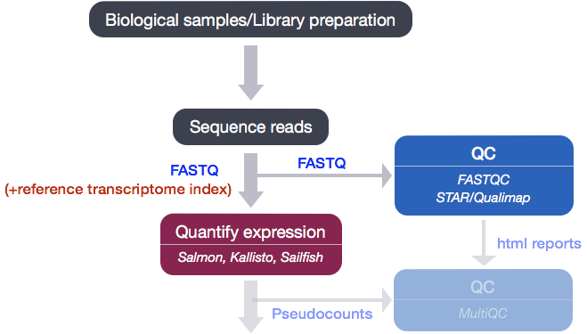
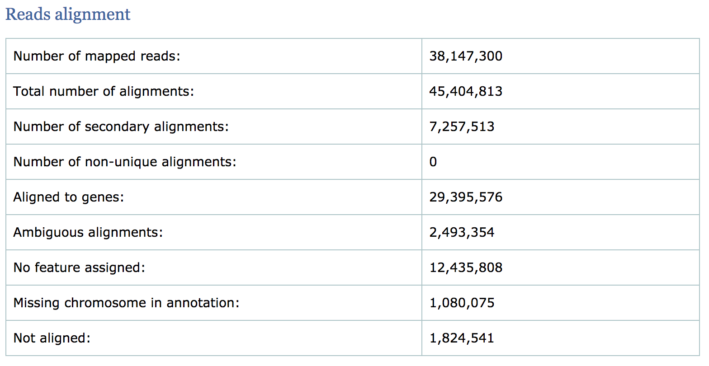
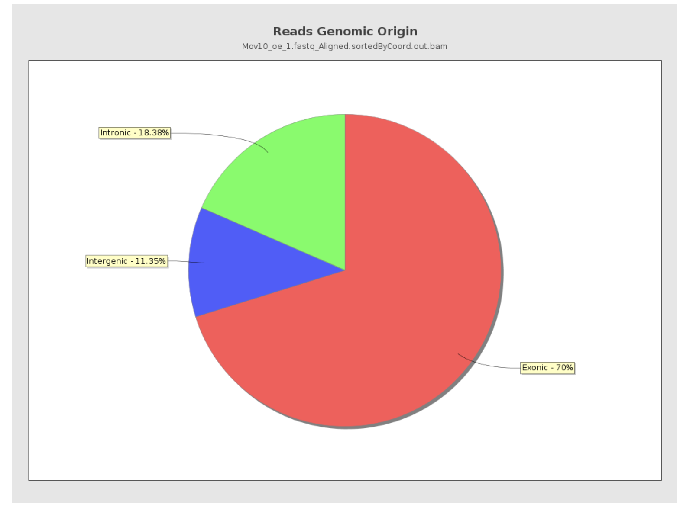
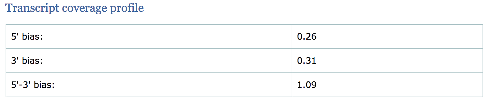
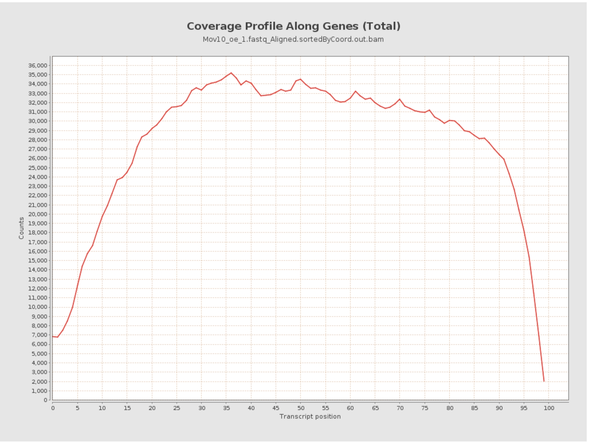
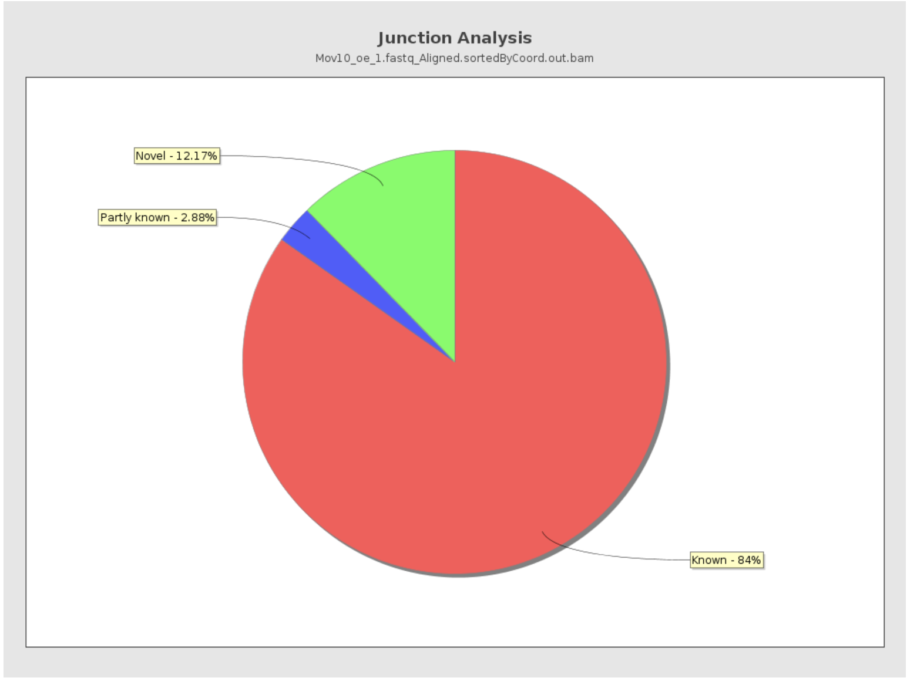

Approximate time: 50 minutes

## Learning Objectives:

* Running Qualimap to compute metrics on alignment files
* Running an alignment tool to generate input for Qualimap (BAM files)


## Quality Control

After running Salmon, we now have transcript-level abundance estimates for each of our samples, however we don't have a good way to be able to determine the following:
* Are there more reads from one end of the gene or another? I.e. do we have 3' or 5' bias.
* What proportion of total reads are mapping to exonic regions? If there are a lot of intergenic or intronic reads, it may indicate DNA contamination.

**In order for us to assess these metrics we need the genomic coordinates of where each read maps**. This information can be generated by mapping (or aligning) reads to the whole genome using genome alignment tools, and can then be used as input to tools that can generate the desired metrics.

<p align="center">

</p>

## Qualimap 

We will be using [Qualimap](http://qualimap.bioinfo.cipf.es/doc_html/intro.html#what-is-qualimap), a Java application, which **provides an overall view of the data quality in an HTML report**. The report is comprehensive with mapping statistics summarized along with useful figures and tab-delimited files of metrics data. We will run Qualimap on a single sample, and then take a detailed look at the report and metrics in comparison to what we would expect for good data.

**Before we can run Qualimap, we need to use a genome alignment tool to get the genomic coordinates of where the reads are aligning to the genome**. Most aligners that work with NGS data generate a very specific file format wherein all the alignment results are organized systematically. This file format is called SAM/BAM (see below).

> #### Alignment file format: SAM/BAM
> The **Sequence Alignment Map format** (SAM) file is **a tab-delimited text file that contains all information from the FASTQ file, with additional fields containing alignment information for each read**. Specifically, we can obtain the genomic coordinates of where each read maps to in the genome and the quality of that mapping. A **BAM file is the binary, compressed version of the SAM file**. It is significantly smaller in size and is usually the file format requested for by downstream tools that require alignment data as input. The paper by [Heng Li et al](http://bioinformatics.oxfordjournals.org/content/25/16/2078.full) provides a lot more detail on the specification.


### Creating a BAM file

To generate a BAM file we need to **map our reads to the genome**. The alignment process consists of choosing an appropriate reference genome to map our reads against and performing the read alignment using one of several splice-aware alignment tools such as [STAR](http://bioinformatics.oxfordjournals.org/content/early/2012/10/25/bioinformatics.bts635) or [HISAT2](http://ccb.jhu.edu/software/hisat2/index.shtml). The choice of aligner is often a personal preference and also dependent on the computational resources that are available to you. 

### STAR Aligner

To determine where on the human genome our reads originated from, we will align our reads to the reference genome using [STAR](http://www.ncbi.nlm.nih.gov/pmc/articles/PMC3530905/) (Spliced Transcripts Alignment to a Reference). STAR is an aligner designed to specifically address many of the challenges of RNA-seq data mapping using a strategy to account for spliced alignments. We will not go into detail about how STAR works, but if you are interested in undertanding the alignment strategy we have [some materials linked here](https://hbctraining.github.io/Intro-to-rnaseq-hpc-salmon/lessons/STAR_alignment_strategy.html).

> **NOTE**: Until recently, the standard approach for RNA-seq analysis has been to map our reads using a splice-aware aligner (i.e STAR) and then use the resulting BAM files as input to counting tools like [featureCounts](http://bioinf.wehi.edu.au/featureCounts/) and [htseq-count](https://htseq.readthedocs.io/en/release_0.11.1/count.html) to obtain our final expression matrix. The field has now moved towards using lightweight alignment tools like Salmon as standard practice, and so we only use STAR for generating a BAM file. If you are interested in knowing more about the standard approach we have some [materials linked here](https://hbctraining.github.io/Intro-to-rnaseq-hpc-salmon/lessons/counting_reads.html).


To get started with this lesson, start an interactive session with 6 cores and 8G of memory:

```bash
$ srun --pty -p interactive -t 0-12:00 -c 6 --mem 8G /bin/bash	
```

You should have a directory tree setup similar to that shown below. It is best practice to have all files you intend on using for your workflow present within the same directory. 

```bash
rnaseq
	├── logs
	├── meta
	├── raw_data
	│   ├── Irrel_kd_1.subset.fq
	│   ├── Irrel_kd_2.subset.fq
	│   ├── Irrel_kd_3.subset.fq
	│   ├── Mov10_oe_1.subset.fq
	│   ├── Mov10_oe_2.subset.fq
	│   └── Mov10_oe_3.subset.fq
	├── results
	└── scripts
```

To use the STAR aligner, load the module: 

```bash
$ module load gcc/6.2.0 star/2.7.0a
```

Similar to Salmon, aligning reads using STAR is **a two step process**:   

1. Create a genome index 
2. Map reads to the genome

> A quick note on shared databases for human and other commonly used model organisms. The O2 cluster has a designated directory at `/n/groups/shared_databases/` in which there are files that can be accessed by any user. These files contain, but are not limited to, genome indices for various tools, reference sequences, tool specific data, and data from public databases, such as NCBI and PDB. So when using a tool that requires a reference of sorts, it is worth taking a quick look here because chances are it's already been taken care of for you. 
>
>```bash
> $ ls -l /n/groups/shared_databases/igenome/
>```

#### Creating a genome index

For this workshop we have generated the genome indices for you, so that we don't get held up waiting on the generation of the indices (it takes a while and requires a lot of memory). The index can be found in the `/n/groups/hbctraining/intro_rnaseq_hpc/reference_data_ensembl38/ensembl38_STAR_index/` directory. 

The command to create an index can be found in the job submission script we have linked [here](../scripts/star_genome_index.run). 

>**NOTE:** By default the latest human genome build, GRCh38, contains information about alternative alleles for various locations on the genome. If using this version of the GRCh38 genome then it is advisable to use the HISAT2 aligner as it is able to utilize this information during the alignment. There is a version of GRCh38 available that does not have these alleles represented, which is the appropriate version to use with STAR. This is because STAR does not have the functionality to appropriately deal with the presence of alternate alleles as yet.

#### Aligning reads

Since we already have the reference index ready, we can move on to aligning reads to the genome.

Create an output directory for our alignment files:

```bash
$ cd ~/rnaseq/raw_data

$ mkdir ../results/STAR
```

For now, we're going to work on just one sample to set up our workflow. To start we will use the first replicate in the Mov10 over-expression group, `Mov10_oe_1.subset.fq`. Details on STAR and its functionality can be found in the [user manual](https://github.com/alexdobin/STAR/blob/master/doc/STARmanual.pdf); we encourage you to peruse through to get familiar with all available options.

The basic options for aligning reads to the genome using STAR are:

* `--runThreadN`: number of threads / cores
* `--readFilesIn`: /path/to/FASTQ_file
* `--genomeDir`: /path/to/genome_indices_directory
* `--outFileNamePrefix`: prefix for all output files

Listed below are additional parameters that we will use in our command:

* `--outSAMtype`: output filetype (SAM default)
* `--outSAMunmapped`: what to do with unmapped reads

> **NOTE:** Note that "**STAR’s default parameters are optimized for mammalian genomes.** Other species may require significant modifications of some alignment parameters; in particular, the maximum and minimum intron sizes have to be reduced for organisms with smaller introns" [[1](http://bioinformatics.oxfordjournals.org/content/early/2012/10/25/bioinformatics.bts635.full.pdf+html)].

The full command is provided below for you to copy paste into your terminal. If you want to manually enter the command, it is advisable to first type out the full command in a text editor (i.e. [Sublime Text](http://www.sublimetext.com/) or [Notepad++](https://notepad-plus-plus.org/)) on your local machine and then copy paste into the terminal. This will make it easier to catch typos and make appropriate changes. 

```bash
$ STAR --genomeDir /n/groups/hbctraining/intro_rnaseq_hpc/reference_data_ensembl38/ensembl38_STAR_index/ \
--runThreadN 6 \
--readFilesIn Mov10_oe_1.subset.fq \
--outFileNamePrefix ../results/STAR/Mov10_oe_1_ \
--outSAMtype BAM SortedByCoordinate \
--outSAMunmapped Within \
--outSAMattributes Standard 
```

#### STAR output 

After running our single FASTQ file through the STAR aligner, you should have a number of output files in the `~/rnaseq/results/STAR` directory. Let's take a quick look at some of the files that were generated and explore their content. 

```bash
$ cd ~/rnaseq/results/STAR
	
$ ls -lh
```

You should have **5 output files** plus a single `.tmp` directory for the Mov10_oe_1 sample. The contents of the 5 files are described below:

* `Log.final.out` - a summary of mapping statistics for the sample
* `Aligned.sortedByCoord.out.bam` - the aligned reads, sorted by coordinate, in BAM format
* `Log.out` - a running log from STAR, with information about the run 
* `Log.progress.out` -  job progress with the number of processed reads, % of mapped reads etc., updated every ~1 minute
* `SJ.out.tab` - high confidence collapsed splice junctions in tab-delimited format. Only junctions supported by uniquely mapping reads are reported

**We are most interested in the BAM file, which will allow us to proceed with Qualimap.**

### Running Qualimap 

Alignment data files frequently contain biases that are introduced by sequencing technologies and/or during sample preparation. Therefore, one of the fundamental requirement during analysis of these data is to perform quality control. In this way, we get an idea of **how well our reads align to the reference** and **how well data fit with the expected outcome**.

We will take the BAM file we generated in the previous step and use it as input to Qualimap which computes various quality metrics such as DNA or rRNA contamination, 5'-3' biases, and coverage biases. 

To **run Qualimap**, change directories to the `rnaseq` folder and make a `qualimap` folder inside the `results` directory:

```bash
$ cd ~/rnaseq

$ mkdir -p results/qualimap
```

By default, Qualimap will try to open a GUI to run Qualimap, so we need to run the `unset DISPLAY` command:

```bash
$ unset DISPLAY
```

We also need to load the qualimap module:

```bash
$ module load java/jdk-1.8u112 qualimap/2.2.1
```

Now we are ready to run Qualimap on our BAM file! There are different tools or modules available through Qualimap, and the [documentation website](http://qualimap.bioinfo.cipf.es/doc_html/command_line.html) details the tools and options available. We are interested in the `rnaseq` tool. To see the arguments available for this tool we can search the help:

```bash
$ qualimap rnaseq 
```

 We will be running Qualimap with the following specifications:

- `-outdir`: output directory for html report
- `-a`: Counting algorithm - uniquely-mapped-reads(default) or proportional (each multi-mapped read is weighted according to the number of mapped locations)
- `-bam`: path/to/bam/file(s)
- `-p`: Sequencing library protocol - strand-specific-forward, strand-specific-reverse or non-strand-specific (default)
- `-gtf`: path/to/gtf/file - **needs to match the genome build and GTF used in alignment**
-  `--java-mem-size=`: set Java memory

```bash
$ qualimap rnaseq \
-outdir results/qualimap/Mov10_oe_1 \
-a proportional \
-bam results/STAR/Mov10_oe_1_Aligned.sortedByCoord.out.bam \
-p strand-specific-reverse \
-gtf /n/groups/hbctraining/intro_rnaseq_hpc/reference_data_ensembl38/Homo_sapiens.GRCh38.92.1.gtf \
--java-mem-size=8G
```

### The Qualimap report

The Qualimap report in HTML folrmat should be present in the `results/qualimap` directory. To view this report you need a web browser, so you would need to transfer it over to your laptop. However, you don't need to do that. We generated this report on a subset of data, to get a better idea of the metrics let's **take a look at the report of the full dataset for `Mov_oe_1`**, available [in this zipped folder](https://www.dropbox.com/s/ck2qdzasthjx7wl/Mov10_oe_1.fastq.qualimap.zip?dl=1). Please download and unzip the folder; find the HTML report within and open it in your browser.

#### **Read alignment summary**

The first few numbers listed in the report are the mapping statistics. Qualimap also computes counts by assigning reads to genes and [reports associated statistics](http://qualimap.conesalab.org/doc_html/analysis.html#id7). For example it computes the following:
* the number of reads aligned to genes
* number of ambiguous alignments (reads matching several genes)
* number of alignments without any feature (intronic and intergenic)

<p align="center">

</p>

> * The percentage of mapped reads is a global indicator of the overall sequencing accuracy. We expect between 70-90% of reads to be mapped for the human genome.  
> * Expect a small fraction of reads to be mapping equally well to multiple regions in the genome (‘multi-mapping reads’). 
> * The count related metrics are not as relevant to us since we have quantified with Salmon at the transcript level.

#### **Reads genomic origin**
This section reports how many alignments fall into exonic, intronic and intergenic regions along with a number of intronic/intergenic alignments overlapping exons. Exonic region includes 5’UTR,protein coding region and 3’UTR region. This information is summarized in table in addition to a pie chart as shown below.

<p align="center">

</p>

> * Even if you have high genomic mapping rate for all samples, check to see where the reads are mapping. Expect a high proportion of reads mapping to exonic regions (> 60%) and lower intronic mapping rates (20 -30%).
> * A higher intronic mapping rate is expected for rRNA removal compared to polyA selection. The intronic reads likely originate from immature transcripts which include either full-length pre-mRNA molecules or nascent transcripts where the RNA polymerase has not yet attached to the 3′ end of the gene. 
> * A roughly equal distribution of reads mapping to intronic, exonic and intergenic regions suggests that there is DNA contamination.
> * Ribosomal RNA (rRNA) constitutes a large majority of the RNA species in any total RNA preparation. Despite depletion methods, you can never achieve complete rRNA removal. Even with Poly-A enrichment a small percentage of ribosomal RNA can stick to the enrichment beads non-specifically. Excess ribosomal content (> 2%) will normally have to be filtered out so that differences in rRNA mapped reads across samples do not affect alignment rates and skew subsequent normalization of the data.


#### **Transcript coverage profile**
The profile provides ratios between mean coverage at the 5’ region, the 3’ region and the whole transcript. Coverage plots are generated for all genes total, and also for the 500 highest-expressed and 500 lowest-expressed genes separately. 

* **5’ bias**: the ratio between mean coverage at the 5’ region (first 100bp) and the whole transcript
* **3’ bias**: is the ratio between mean coverage at the 3’ region (last 100bp) and the whole transcript
* **5’-3’ bias**: is the ratio between both biases.

<p align="center">

</p>

<p align="center">

</p>

> * In a perfect sequencing experiment you would expect to see a 5'-3' bias ratio of 1 with low coverage at both ends of the transcript. This would suggest no bias is present.
> * It is well-documented that libraries prepared with polyA selection can lead to high expression in 3' region (3' bias). At least [one study](https://genomebiology.biomedcentral.com/articles/10.1186/gb-2014-15-6-r86) shows the reverse effect for rRNA removal. 
> * If reads primarily accumulate at the 3’ end of transcripts in poly(A)-selected samples, this might indicate low RNA quality in the starting material.

#### **Junction Analysis**

Qualimap also reports the total number of reads mapping to splice junctions and the 10 most frequent junction rates. The pie chart shows analysis of junction positions in spliced alignments. 

* Known category represents percentage of alignments where both junction sides are known. 
* Partly known represents alignments where only one junction side is known. 
* All other alignments with junctions are marked as Novel.

<p align="center">

</p>


> Other tools like [RNASeQC](https://software.broadinstitute.org/cancer/cga/rna-seqc) will plot figures that can help evaluate **GC content bias**. This is also an important aspect of QC, as low/high GC content regions will tend to have low coverage.

***

## Summary

Taken together, these metrics give us some insight into the quality of our samples and help us in identifying any biases present in our data. The conclusions derived from these QC results may indicate that we need to correct for these biases and so you may want to go back and modify the parameters for Salmon (mapping) accordingly.

---
*This lesson has been developed by members of the teaching team at the [Harvard Chan Bioinformatics Core (HBC)](http://bioinformatics.sph.harvard.edu/). These are open access materials distributed under the terms of the [Creative Commons Attribution license](https://creativecommons.org/licenses/by/4.0/) (CC BY 4.0), which permits unrestricted use, distribution, and reproduction in any medium, provided the original author and source are credited.*
