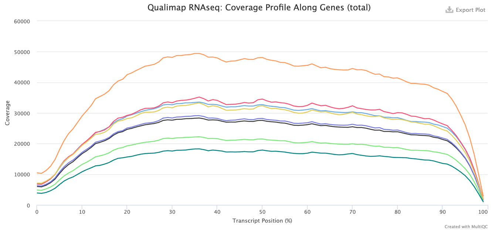

Approximate time: 30 minutes

## Documenting results and gathering QC metrics

As you go through the RNA-seq workflow (or any data analysis workflow), it is important to document the parameters you used for running the analysis. In addition, it is also very important to document the metrics/results at every step. Careful evaluation of metrics is a form of QC, and it will enable you to identify any issues with the data and/or the parameters you are using, as well as alert you to the presence of contamination or systematic biases, etc.  

There are several metrics you can evaluate in the RNA-seq workflow. Below are 3 important ones that you should keep track of for each sample:

* number of raw reads
* percentage of reads aligned to genome
* percentage of reads associated with genes 

An important QC step is to make sure that these metrics are consistent across the samples for a given experiment, and any outliers should be investigated further.

Manually tracking these metrics is tedious and error-prone. Many tools can help you with the documentation and QC assessment, some of which also have really nice visualizations to easily identify any issues, e.g. [FastQC](https://www.bioinformatics.babraham.ac.uk/projects/fastqc/), [Qualimap](http://qualimap.bioinfo.cipf.es/doc_html/index.html), [MultiQC](http://multiqc.info/). Some of these tools tend to focus on a single sample at a time, and on QC for a specific step in the workflow. MultiQC, on the other hand, is able to make a report from the output of many different tools (for RNA-seq analysis and other NGS workflows) and it is able to combine the information for multiple samples.

### Tracking and aggregating results from workflow tools with *MultiQC*

In this lesson, we will be using MultiQC to aggregate results from several tools and generates a single HTML report with plots to visualize and compare QC metrics between the samples.

MultiQC can generate this report from 96 different bioinformatics tools, and these tools span various NGS analyses, e.g., basic QC, RNA-seq, ChIP-seq, variant calling, genome annotation, etc. We are going to use it to aggregate information from the results of [FastQC](http://multiqc.info/docs/#fastqc), [STAR](http://multiqc.info/docs/#star), [Qualimap](http://multiqc.info/docs/#qualimap), and [salmon](http://multiqc.info/docs/#salmon). MultiQC can parse the information from **specific output files** of these tools.

Start by creating a directory for our output called `multiqc_report`:

```bash
$ cd ~/rnaseq/

$ mkdir results/multiqc_report
```

Then navigate into that directory: 

```bash
$ cd results/multiqc_report
```

Next, load the three modules needed to run MultiQC: `gcc`, `python`, `multiqc`.

```bash
$ cd results/multiqc_report

$ module load gcc/6.2.0 python/2.7.12 multiqc/1.5
```
***

**Exercise**

How did we know which modules to load in addition to multiqc?

***

We are going to run MultiQC on the following 4 outputs from our workflow:

* `.zip` files from FastQC
* `.Log.final.out` files from STAR
* `.qualimap` files from Qualimap
* `.salmon` directories from salmon

To create a more meaningful report to look at we thought it best to run MultiQC on the full dataset instead of the subset we have been working with so far. We have run each of the tools mentioned above on the full dataset and stored the result in the directory `/n/groups/hbctraining/rna-seq_2019_02/snapshots/full_dataset_results`. We will point to these files as input for our MultiQC analysis.

To run MultiQC, we can provide it two inputs at a minimum:

1. a name for our output report and folder
2. the paths to our results files

> **NOTE:** MultiQC has additional parameters we could include; use `multiqc -h` to find out more.

```bash
$ multiqc -n multiqc_report_rnaseq \
/n/groups/hbctraining/rna-seq_2019_02/snapshots/full_dataset_results/fastqc/*zip \
/n/groups/hbctraining/rna-seq_2019_02/snapshots/full_dataset_results/STAR/*Log.final.out \
/n/groups/hbctraining/rna-seq_2019_02/snapshots/full_dataset_results/qualimap/* \
/n/groups/hbctraining/rna-seq_2019_02/snapshots/full_dataset_results/salmon/*salmon
```

> **NOTE**: You will see the progress of analysis printed out on the terminal as the tool runs. If you want to save this output into a log file (for future reference), you can use `2>` operator to redirect it to a file. For example, at the end of script, add `2> log.txt`. `2>`redirects the output of so-called standard error.

It takes a couple of minutes to generate the MultiQC report. The report provides nice visualizations across samples, which is very useful to determine consistency and to identify problematic samples.

The output of MultiQC is one HTML file (`multiqc_report_rnaseq.html`) and a data folder. Transfer the interactive HTML report over to your laptop using **FileZilla**, and visualize the outputs of the four tools we used to generate the report.

> *For a refresher on using Filezilla, please refer back to our [FastQC assessment lesson](07_qc_fastqc_assessment.md).*

## Assessing the quality control metrics

The main metrics to explore first are:

* number of raw reads or total reads
* percentage of reads aligned to genome
* percentage of reads associated with genes 

> Note: If you don't see exact columns as ours, you may need to configure the columns, which is a button just underneath the 'General Statistics' heading. 

<p align="center">

  </p>

Using `Configure Columns` button, we are going to choose the following columns:

<p align="center">

  </p>

In the above image, the description column is helpful in interpretating the table. Upon perusal of the table, we can see input from FastQC, STAR, Qualimap and salmon. For example, the total number of raw reads is given in the `M Seqs` column on the far right of the table. 

STAR provides information about *uniquely mapping reads* in the `%Aligned` column. A good quality sample will have **at least 75% of the reads uniquely mapped**. Once the value starts to drop below 60%, it's advisable to start troubleshooting. Low number of uniquely mapping reads means that more reads are mapped to multiple locations. 

The 'STAR: Alignment Scores' plot visually represents this mapping information. The % uniquely mapped, multimapped, and unmapped reads can be easily compared between samples to get a nice overview of the quality of the samples.

<p align="center">

  </p>

> NOTE: The thresholds suggested above will vary depending on the organism that you are working with. Much of what is discussed here is in the context of working with human or mouse data. For example, 75% of mapped reads holds true only if the genome is good or mature. For badly assembled genomes, we may not observe a high mapping rate, even if the actual sequences from the sample are good.

Salmon also provides a `%Aligned` column representing the percent of mapped reads. The percentage from Salmon is different from that of STAR, because STAR is based on the alignment to genome reference, while Salmon is based on the alignment to transcriptome reference. Since we will be using the salmon abundance estimates for downstream analysis, these numbers are particularly important for our analysis.


### Complexity

The complexity of the RNA-seq library can be explored with the `%Dups` column. If a large percentage of the library is duplicated, then this could indicate a library of either low complexity or over-amplification. If huge differences of `%Dups` exist between samples, this may lead to biases in the data, such as different %GC content.

### Exploring biases

Within this report, we can also explore the bias metrics output by Qualimap and FastQC. The `5'-3' bias` column denotes whether our data has any 5' or 3' biases. These biases could be due to RNA degradation or different sample preparation techniques. Generally, we should explore our data more if we have biases approaching 0.5 or 2. 

The transcript position plot can also help identify 5' or 3' bias, in addition to other coverage issues. We generally expect roughly even coverage.

<p align="center">

  </p>

In addition, we can see whether our different samples have differences in `%GC` column. GC bias could be caused by low-complexity libraries, differences in amplification, or library-specific issues. We expect to observe similar GC content aross samples.

### Contamination

We can also identify possible contamination of our samples by inspecting the percentage of reads that are exonic, intronic or intergenic. High levels of intergenic reads is indicative of DNA contamination (>30%). Also, if polyA selection of messenger RNAs was performed in library preparation, then high percentages of intronic reads would also be concerning. 

<p align="center">

  </p>

Generally speaking, in a good library, we expect over 60% of reads to be mapped to exons for mouse or human organisms. For other organisms, the percentage depends on how well the genome is annotated.

### Fragment length distribution 

The auxiliary directory generated from Salmon will contain a file called `fld.gz`. This file contains an approximation of the observed fragment length distribution. This is more meaningful for paired-end data, where the length can be estimated based on the location from both ends of the fragment. These plots can be compared to our expectations based on our knowledge of the size selection step performed during the library preparation stage.

> **NOTE:** For single end data (which is what we have), Salmon reports a fixed insert length distribution. Therefore, the values are identical for all samples, and we only observe one distribution curve in the plot.

<p align="center">

</p>

---
*This lesson has been developed by members of the teaching team at the [Harvard Chan Bioinformatics Core (HBC)](http://bioinformatics.sph.harvard.edu/). These are open access materials distributed under the terms of the [Creative Commons Attribution license](https://creativecommons.org/licenses/by/4.0/) (CC BY 4.0), which permits unrestricted use, distribution, and reproduction in any medium, provided the original author and source are credited.*
