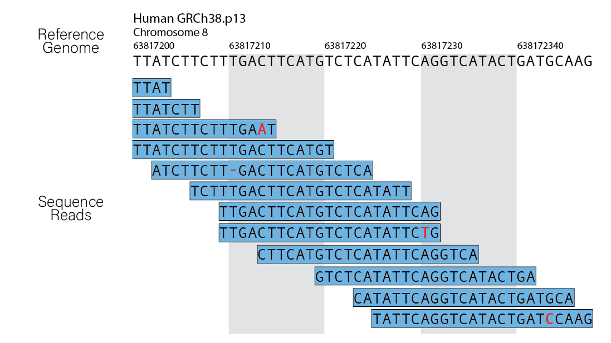

## Learning Objectives:

* Describe differences between genome-mapping versus transcriptome-mapping techniques when aligning RNA-seq data
* Differentiate between the various reference files needed when running RNA-seq alignment

## What is Sequence Alignment?

 Sequence alignment is a process through which DNA, RNA or protein sequences are compared to a reference sequence(s) in order to find a corresponding match between the queried sequence and the reference sequence. You may have already come across the popular **BLAST** (<ins>B</ins>asic <ins>L</ins>ocal <ins>A</ins>lignment <ins>S</ins>earch <ins>T</ins>ool) algorithm already. Sequence alignment is one of the most fundamental tools in bioinformatics and it has wide-ranging applications including:

  * Deriving the likely species of origin for an unknown sample
  * Comparing genomic rearrangements between closely related species
  * Estimating gene expression
  * Many more applications
 
 In addition to [BLAST](https://blast.ncbi.nlm.nih.gov/Blast.cgi), other popular alignment tools include [HISAT2](http://daehwankimlab.github.io/hisat2/), [bwa](http://bio-bwa.sourceforge.net), [STAR](https://github.com/alexdobin/STAR) and others. Each of these alignement tools handles sequence alignment differently. Some of these differences are important and we will discuss below, but many of these differences are beyond the scope of this lesson. Recently, some software packages used for analyzing RNA-Seq data ([Salmon](https://combine-lab.github.io/salmon/) and [Kallisto](https://pachterlab.github.io/kallisto/about)) have been introduced and they handle alignment a bit differently than the previously mentioned alignment tools. In this lesson, we will discuss historical and current alignment techniques in order to prepare you for carrying out your own sequence alignment.
 
 ## Finding the Needle in the Haystack
 
 Imagine that you have a set of short sequence of DNA and you want to try to figure out which region of the genome these sequences came from. How might you go about doing this? Perhaps you would print out your sequences and slide them along your entire genome until you find the perfect match. While this may work, it is quite slow and tedious and it is not very forgiving to human or technically-derived errors. Alternatively, perhaps you decide you will write a piece of software to carry out the process for you in order to speed up the analysis and eliminate human-derived errors. After all, how hard can this be? It is just simple string matching right? Perhaps you're envisioning your software to produce an output that looks like this:

 
### Sequencing Errors 
 
Easy enough, except it isn't. While in the simplified case above this may work, it will likely run into several problems. Your first, and likely the biggest, issue will be sequencing errors. All modern sequencing technologies have sequencing errors. While the sequencing platform you use will influence the [number and type of sequencing errors](http://bio.as.uky.edu/sites/default/files/comparison%20of%20next%20gen%20sequencing.pdf) error rates among NGS sequencers can vary greatly. There are various sources for these sources of sequencing error, but they are beyond the scope of this discussion. Regardless, you will want your software to accomodate sequencing errors where the sequencer has misread a base or skipped over a base. 

> ***NOTE:*** While much less common in most cases, there also could be sequencing errors in the reference sequence(s). This could make your properly sequenced data appear to have sequencing errors in it, but in reality the reference sequence you are using for alignment is erroreous. 

### Speed

Okay, so know your software accomodates sequencing errors, but it comes at the cost of speed. No longer are you just able to match strings of characters together to find their best match. You now need to permutate each query sequence that isn't a perfect match in order to help it find its best match. All of this permutating and searching will take a very long time. Remember, your data has millions to hundreds of millions of searches to do. 

Hopefully this brief exercise has illuminated the difficulties involved in sequence alignment.

